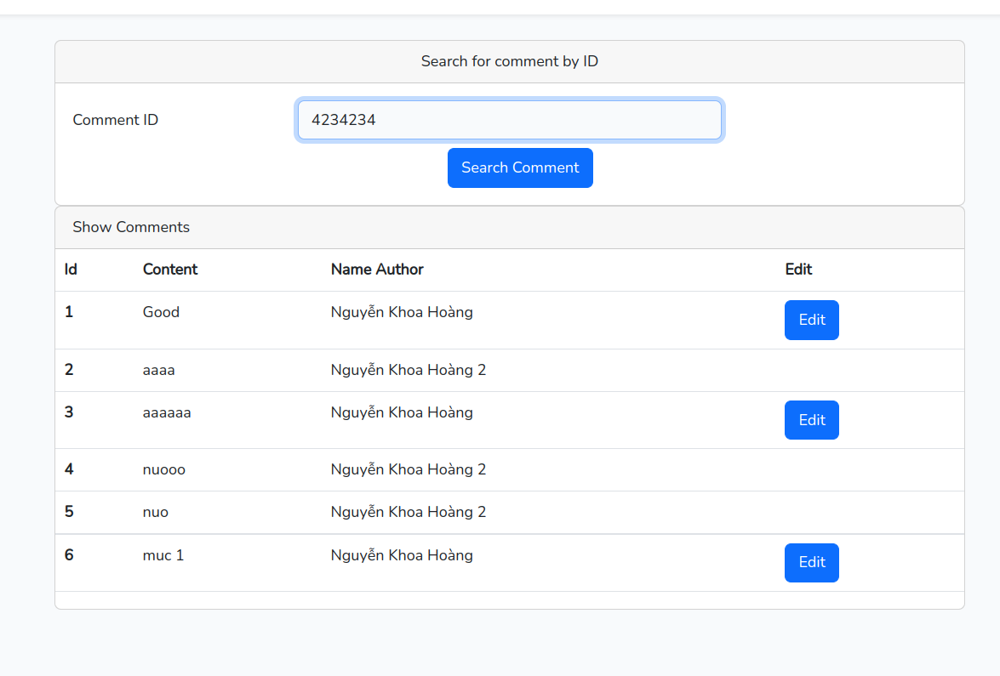
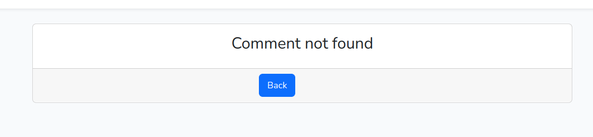
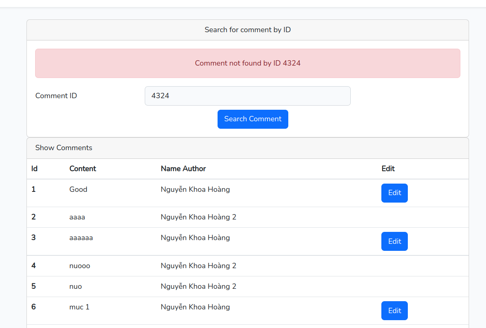
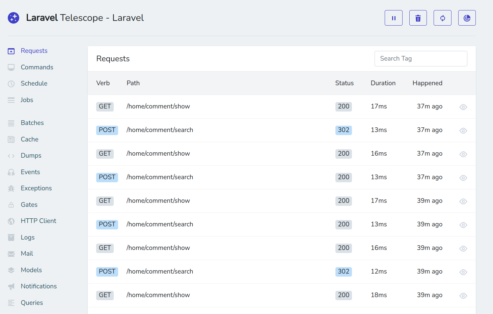
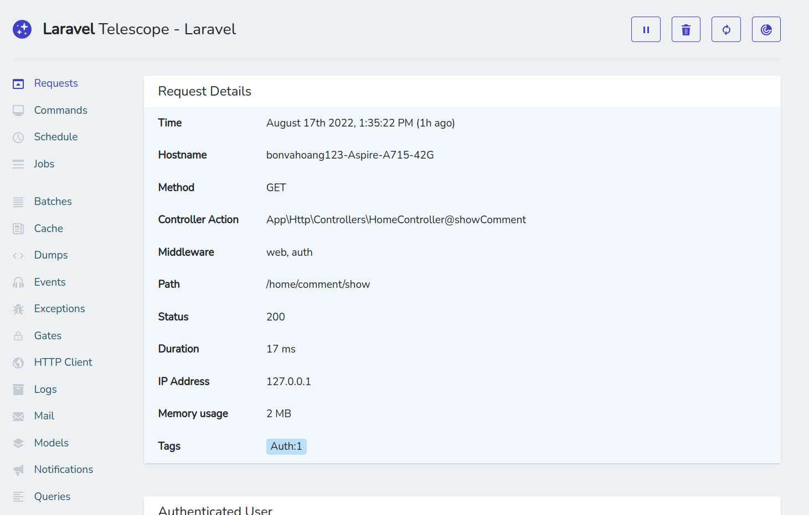
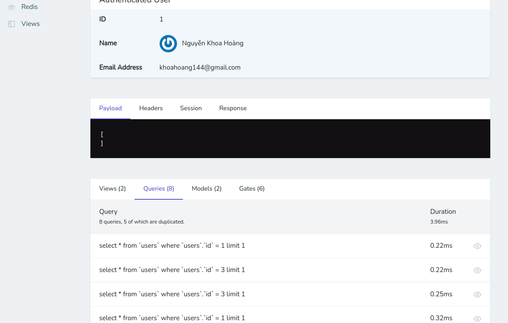
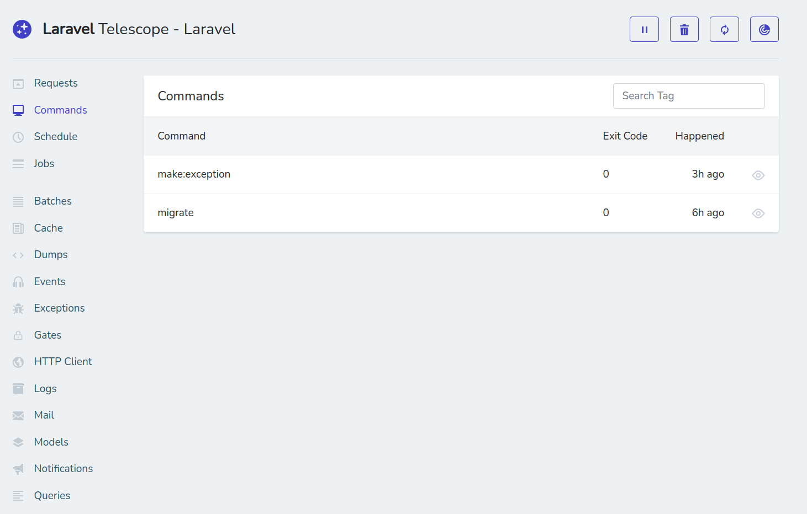
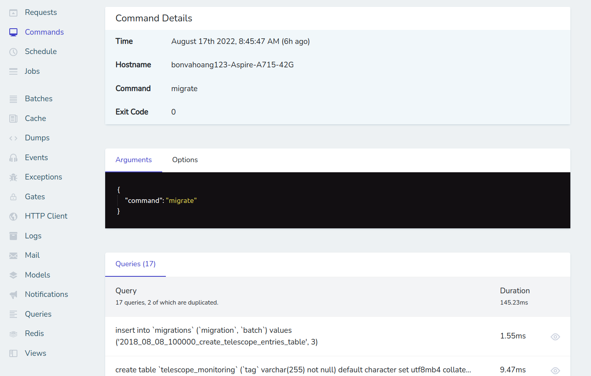
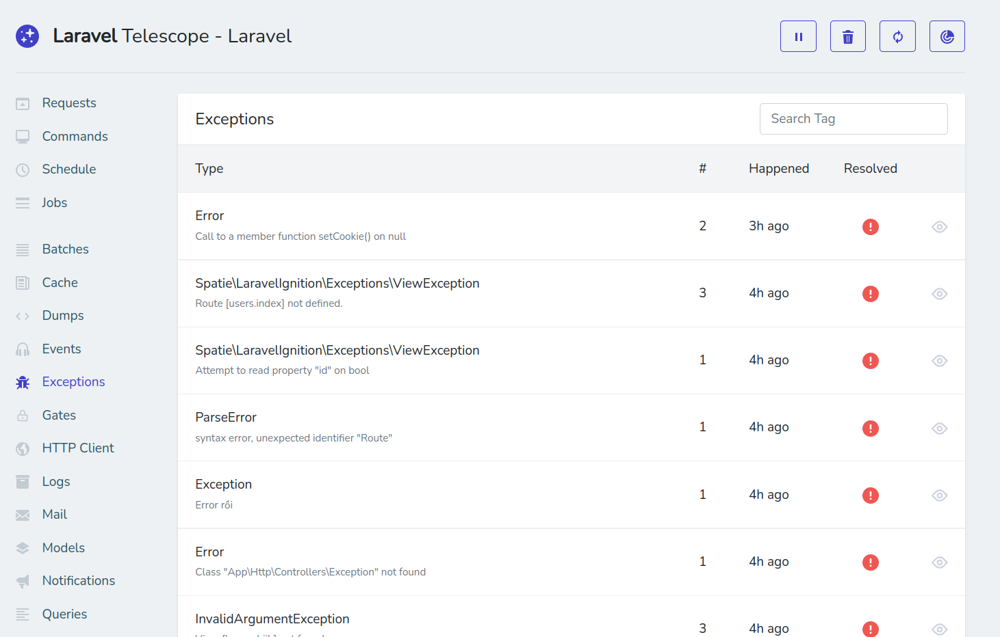
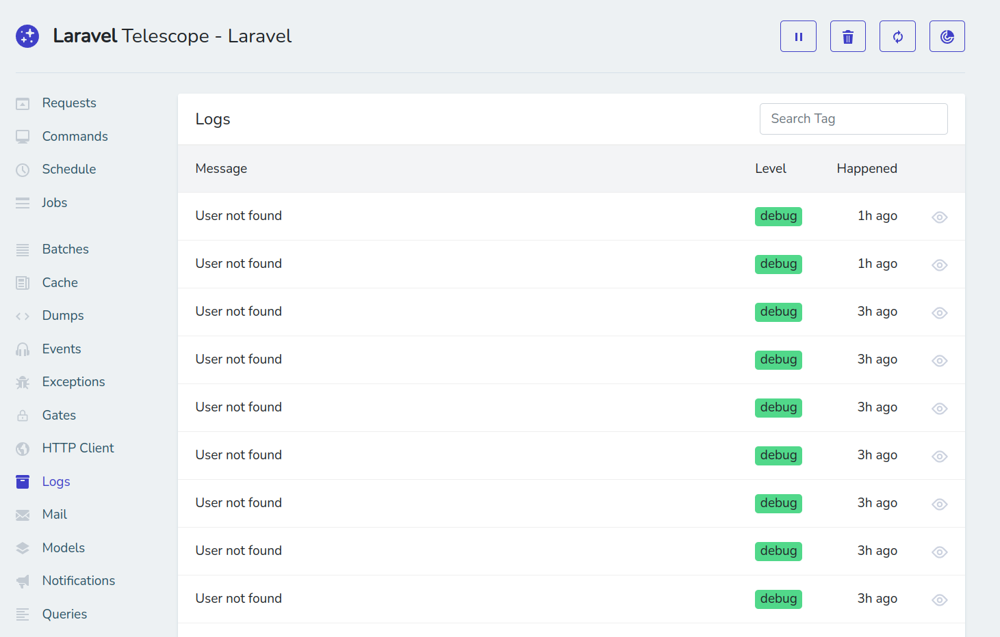

## [Link to Repository Exception](https://github.com/NguyenKhoaHoang/Auth-Laravel)
# I. How Laravel handle exception?
- Các Exception mặc định của Laravel sẽ được xử lý tại file vendor/laravel/framework/src/Illuminate/Foundation/Http/Kernel.php ở phương thức handle()
```
    public function handle($request)
    {
        try {
            $request->enableHttpMethodParameterOverride();

            $response = $this->sendRequestThroughRouter($request);
        } catch (Throwable $e) {
            // Report
            $this->reportException($e);

            // Render
            $response = $this->renderException($request, $e);
        }

        $this->app['events']->dispatch(
            new RequestHandled($request, $response)
        );

        return $response;
    }
```

- Tất cả exception mà chưa được catch trong app sẽ được catch tại đây và được Laravel xử lý qua 2 bước:
    + Report: báo cáo exception tới các channels khác nhau và ghi vào log
    + Render: Hiển thị các lỗi Excetion ra 1 màn hình mà người dùng có thể đọc được lỗi và các chi tiết liên quan
## 1. Custom Exception
- Ở file App\Exceptions\Handler.php có phương thức register() đóng vai trò đăng ký các exception và xử lý các exception đó theo ý của bạn khi được bắt
```
    public function register()
    {
        $this->reportable(function (InvalidOrderException $e) {
            //
        });
        
        // mặc định laravel sẽ bắt tất cả các throw trong ứng dụng của bạn 
        $this->reportable(function (Throwable $e) {

        });

        // trả về trang home nếu bắt được CommentException 
        $this->renderable(function (CommentException $exception) {
            return response()->view('home');
        });

    }
```

- Nếu bạn không muốn report ghi log một exception nào đó thì khai báo class exception đó vào $donReport của lớp Handler
```
    /**
    * A list of the exception types that are not reported.
    *
    * @var array<int, class-string<\Throwable>>
    */
    protected $dontReport = [
        InvalidArgumentException::class
    ];
```

## 2. Make your own Exception
- Để tạo 1 Exception chúng ta dùng lệnh
```
    php artisan make:exception CommmentException
```
- Trong file này sẽ có các hàm cơ bản
```
    class CommentException extends Exception
    {
        /**
        * Report hoặc log ra một thông báo khi gặp exception
        *
        * @return void
        */
        public function report()
        {
            Log::debug('User not found');
        }

        // render ra một màn hình nào đó nếu gặp exception
        public function render($request)
        {
            return response()->view('errors.comments');
        }
    }
```

- Ở đây ta tạo ra một CommentService chứa hàm search, hàm search này nếu không tìm thấy sẽ throw ra 1 CommentException với 1 message
```
    <?php

    namespace App\Services;

    use App\Exceptions\CommentException;
    use App\Models\Comment;
    use Illuminate\Database\Eloquent\ModelNotFoundException;

    class CommentService
    {
        public function search($id)
        {
            $commentSearch = Comment::find($id);
            if (!$commentSearch) {
                throw new CommentException('Comment not found by ID ' . $id);
            }

            return $commentSearch;
        }
    }
```

- Ở file Controller có hàm searchComment thực hiện tìm kiếm comment và sẽ trả về màn hình hiện lỗi nếu có lỗi
```
    public function searchComment(Request $request)
    {
        try {
            $commentSearch = $this->commentService->search($request->id);
        } catch (CommentException $exception) {
            // Cách 1: đưa ra màn hình lỗi
            throw $exception;

            // Cách 2: quay lại màn hình cũ với 1 message error
            // return back()->withError($exception->getMessage())->withInput();

        }
        return view('comments.show', compact('commentSearch'));
    }
```
### Màn hình tìm kiếm comment


### Màn hình Exception cách 1


### Màn hình Exception cách 2



# II. Tinker
- Tinker là tính năng giúp người dùng nhanh chóng đọc được dữ liệu ngay bên trong project
- Để sử dụng ta dùng lệnh
```
  php artisan tinker
```

- Một vài câu lệnh xử lý với Database
```
>>> Comment::count();
=> 6
>>> Comment::all();
=> Illuminate\Database\Eloquent\Collection {#3768
     all: [
       App\Models\Comment {#3749
         id: 1,
         user_id: 1,
         content: "Good",
         created_at: null,
         updated_at: "2022-08-17 01:43:22",
       },
       App\Models\Comment {#3758
         id: 2,
         user_id: 3,
         content: "aaaa",
         created_at: null,
         updated_at: null,
       },
       App\Models\Comment {#3742
         id: 3,
         user_id: 1,
         content: "aaaaaa",
         created_at: "2022-08-16 07:00:07",
         updated_at: "2022-08-16 07:00:07",
       },
       App\Models\Comment {#3752
         id: 4,
         user_id: 3,
         content: "nuooo",
         created_at: "2022-08-16 07:00:37",
         updated_at: "2022-08-16 07:00:37",
       },
       App\Models\Comment {#3780
         id: 5,
         user_id: 3,
         content: "nuo",
         created_at: "2022-08-16 07:43:11",
         updated_at: "2022-08-16 07:43:11",
       },
       App\Models\Comment {#3747
         id: 6,
         user_id: 1,
         content: "muc 1",
         created_at: "2022-08-16 07:43:42",
         updated_at: "2022-08-16 07:43:42",
       },
     ],
   }
>>> $user = Comment::find(1);
=> App\Models\Comment {#3734
     id: 1,
     user_id: 1,
     content: "Good",
     created_at: null,
     updated_at: "2022-08-17 01:43:22",
   }

>>> $user->user->name;
=> "Nguyễn Khoa Hoàng"
```

- Ngoài đọc dữ liệu thì ta cũng có thể tác động tới dữ liệu
```
$user = new User;
$user->name = "Canh dep trai";
$user->email = "canhdeptrai@gmail.com";
$user->save();

$user = User::find(1);
$user->delete();
```
- Còn nhiều chức năng khác như tạo hàm
```
>>> function sayHello($name) {
... return "Hello {$name}"; }
>>> sayHello("NKH");
=> "Hello NKH"
```

# III. Telescope
- Laravel Telescope là 1 package cung cấp giao diện hỗ trợ debug cho Laravel Framework. Telescope cung cấp tổng quan về các request đến ứng dụng, exceptions, logs, các query đến database, các job trong queue, mail, notifications, các biến được dump,... Telescope là công cụ hỗ trợ hiệu quả cho môi trường Dev.

## Giới thiệu về một vài Tabs trong Telescope
### 1. HTTP Requests
- Tab này cho phép chúng ta theo dõi toàn bộ các HTTP Request đến ứng dụng của mình.


- Nhấn vào con mắt để xem chi tiết liên quan đến request đấy



### 2. Command
- Command tab sẽ hiển thị toàn bộ các command được thực thi và exit code của chúng. 

- Nhấn vào để xem chi tiết command đó đã thực hiện những gì



### 3. Exceptions
- Hiển thị toàn bộ các exceptions và cho phép bạn inspect chúng. 


### 4. Logs
- Hiển thị toàn bộ các log được in ra


# IV. Questions
## 1. Các exception được log ở đâu?
- Các exception được log ra mặc định ở file /storage/logs/laravel.log
## 2. Có cách nào để không log 1 exception nào đó không?
- Vào file /app/Exceptions/Handler.php và ghi lớp của Exception không muốn log ra vào mảng $dontReport
- Ví dụ:
```
    protected $dontReport = [
        InvalidArgumentException::class
    ];
```


