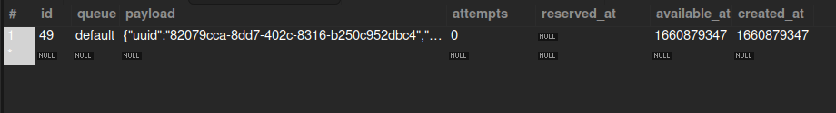
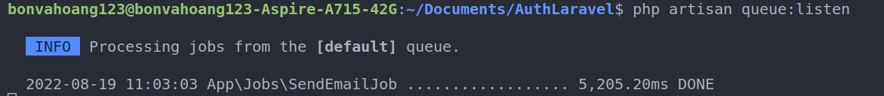
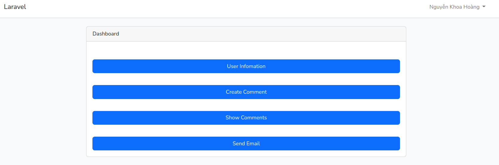
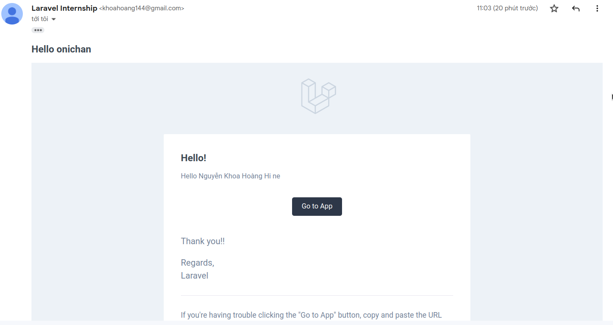
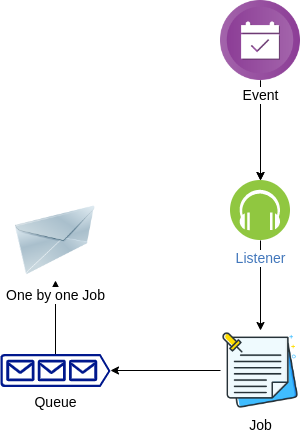

# I. Tìm hiểu về Event và Listener
- Event là sự kiện, hành động nào đó xảy ra tại một thời điểm xác định, ví dụ: vào lúc bấm nút đặt hàng thì sẽ sinh ra sự kiện gửi mail cho người đặt.
- Listener thực hiện xử lý tác vụ khi một sự kiện nào đó xảy ra. Có thể có nhiều Listener thực hiện cùng lúc khi 1 Event xảy ra
- Đăng ký Event và Listener: 
    + Trong file /app/Providers/EventServiceProvider.php có thuộc tính $listen dùng để khai báo các event và các listen thuộc event đó. 
    + Hãy để các file Event trong folder /app/Events.
    + Và để các file Listener trong folder /app/Listeners.
```
    use App\Events\DemoEvent;
    use App\Listeners\DemoListener;
    use App\Listeners\DemoListener2;

    protected $listen = [
        // Đăng ký Event
        DemoEvent::class => [
            // Đăng ký các Listener của Event
            DemoListener::class,
            DemoListener2::class,
        ]
    ];
```
- Sau đó dùng lệnh sau để sinh ra các file Event và Listener đã đăng ký
```
    php artisan event:generate
```

- Thêm 1 cách để đăng ký là dùng lệnh để make:event và make:listener tương ứng với event đó, sau đó rồi đăng ký tại phương thức boot() của EventServiceProvider
```
    php artisan make:event PodcastProcessed
    
    php artisan make:listener SendPodcastNotification --event=PodcastProcessed
```

```
    use App\Events\PodcastProcessed;
    use App\Listeners\SendPodcastNotification;
    use Illuminate\Support\Facades\Event;
    
    /**
    * Register any other events for your application.
    *
    * @return void
    */
    public function boot()
    {
        Event::listen(
            PodcastProcessed::class,
            [SendPodcastNotification::class, 'handle']
        );
    
        Event::listen(function (PodcastProcessed $event) {
            //
        });
    }
```

- Định nghĩa Event: tại file event PodcastProcessed ta định nghĩa thuộc tính name và user tạo hàm construct để khi khởi tạo event thì có thể lấy được các thông tin cần thiết để xử lý
```
<?php

namespace App\Events;

use App\Models\User;
use Illuminate\Broadcasting\Channel;
use Illuminate\Broadcasting\InteractsWithSockets;
use Illuminate\Broadcasting\PresenceChannel;
use Illuminate\Broadcasting\PrivateChannel;
use Illuminate\Bus\Queueable;
use Illuminate\Contracts\Broadcasting\ShouldBroadcast;
use Illuminate\Contracts\Queue\ShouldQueue;
use Illuminate\Foundation\Events\Dispatchable;
use Illuminate\Queue\SerializesModels;

class PodcastProcessed
{
    use Dispatchable, InteractsWithSockets, SerializesModels;

    public $name;
    public $user;
    /**
     * Create a new event instance.
     *
     * @return void
     */
    public function __construct($name, User $user)
    {
        $this->name = $name;
        $this->user = $user;
    }

    /**
     * Get the channels the event should broadcast on.
     *
     * @return \Illuminate\Broadcasting\Channel|array
     */
    public function broadcastOn()
    {
        return new PrivateChannel('channel-name');
    }
}
```

- Định Nghĩa Listener: tại hàm handle() là phương thức xử lý tác vụ khi 1 Event xảy ra. Ta có thể lấy các thông tin name và user mà ta đã lấy được lúc định nghĩa Event qua biến $event
```
<?php

namespace App\Listeners;

use App\Events\PodcastProcessed;
use App\Jobs\SendEmailJob;
use App\Mail\HelloMail;
use App\Models\User;
use Illuminate\Bus\Queueable;
use Illuminate\Contracts\Queue\ShouldQueue;
use Illuminate\Queue\InteractsWithQueue;
use Illuminate\Support\Facades\Auth;
use Illuminate\Support\Facades\Log;
use Illuminate\Support\Facades\Mail;

class SendPodcastNotification
{
    /**
     * Create the event listener.
     *
     * @return void
     */
    public function __construct()
    {
    }

    /**
     * Handle the event.
     *
     * @param  \App\Events\PodcastProcessed  $event
     * @return void
     */
    public function handle(PodcastProcessed $event)
    {
        Log::info('Hello ' . $event->name, [
            'user' => $event->user,
        ]);
        SendEmailJob::dispatch($event->user);
    }
}

```

- Bạn có thể Handling khi một Listener thực hiện fail công việc trong hàm handle bằng hàm failed()
```
    public function failed(PodcastProcessed $event, $exception)
    {
        Log::error($exception->message);
    }
```

- Và cuối cùng là thực hiện Event
```
    public function sendMail()
    {
        event(new PodcastProcessed('Hoang', Auth::user()));
        return redirect()->back();
    }
```

# II. Tìm hiểu về Queue và Job
- Queue hiểu đơn giản là chia các tác vụ mất thời gian thành nhiều luồng chạy song song khác nhau cho đỡ tốn thời gian chờ của người dùng.
- Thực chất Queue là một hàng đợi chứa các tác vụ cần xử lý, tác vụ nào đưa vào trước sẽ được xử lý trước, tác vụ nào đưa vào sau sẽ được xử lý sau. Và quan trọng nhất là Queue trong Laravel có thể chạy ngầm.
- Chạy ngầm ở đây tức là nó không yêu cầu user phải đợi. 
- Ví dụ tác vụ gửi email: 
  + Gửi 5 cái email thì người dùng cần phải đợi 20s mới có thể tiếp tục.
  + Nếu áp dụng Queue thì người dùng chỉ cần phải đợi 1s là có thể tiếp tục công việc.
  + Nhưng các tác vụ gửi mail(các Job) vẫn chưa được thực hiện. Nó sẽ được đưa và queue(hàng đợi) và trong trạng thái chuẩn bị để gửi.
## Ưu điểm của Queue và khi nào nên sử dụng Queue
- Ưu điểm: 
  + Do các tác vụ có thể chạy ngầm, và chạy sau khi hệ thống đã phản hồi, nên không yêu cầu user phải đợi lâu.
  + Chỉ khi hệ thống rỗi, các tác vụ trong Queue mới được thực hiện, điều này giúp dự án của bạn chạy mượt mà hơn trong các giờ cao điểm.
- Khi nào nên sử dụng Queue:
  + Các tác vụ chạy độc lập, không liên quan tới nhau.
  + Tác vụ tốn nhiều thời gian để thực hiện, như việc gửi mail, backup dữ liệu.
  + Tác vụ không cần phải phàn hồi ngay, thậm chí có thể trì hoãn 1, 2 phút mà không làm ảnh hưởng tới người dùng.

## Cách sử dụng Queue và Job
1. Vào .env đổi dòng **QUEUE_DRIVER=sync** thành **QUEUE_DRIVER=database**

2. Tạo ra bảng chứa các tác vụ Job khi được đưa vào hàng đợi Queue
```
php artisan queue:table # Sẽ tạo ra các migrations mới liên quan tới queue
php artisan migrate # Migrate các migrations mới tạo ra
```


3. Tạo ra một Job và đưa Job vào hàng đợi
- Dùng lệnh make:job để tạo ra 1 file chứa tác vụ cần thực hiện
```
php artisan make:job SendEmailJob
```

- File job này chứa method handle() để xử lý các tác vụ ở đây là tác vụ gửi mail và nhận các thông tin được truyền vào thông qua hàm dựng construct.
- Ngoài ra lớp này còn implement lớp ShouldQueue và có các thuộc tính của lớp đó như:
    + delay: sẽ được thực hiện sau bao lâu đó sau khi được vào hàng đợi queue.
    + tries: số lần cố gắng thực hiện Job nếu Job fail.
    + timeout: thời gian chạy tối đa theo giây cho 1 Job.
    + queue: nếu không xét thuộc tính này thì các job sẽ được đưa và hàng đợi queue default, còn nếu xét thì sẽ được đưa vào hàng đợi queue đó.
    + hàm failed: sẽ được thực hiện nếu Job fail.
```
<?php

namespace App\Jobs;

use App\Mail\HelloMail;
use App\Notifications\SendNotificationEmail;
use Illuminate\Bus\Queueable;
use Illuminate\Contracts\Queue\ShouldBeUnique;
use Illuminate\Contracts\Queue\ShouldQueue;
use Illuminate\Foundation\Bus\Dispatchable;
use Illuminate\Queue\InteractsWithQueue;
use Illuminate\Queue\SerializesModels;
use Illuminate\Support\Facades\Log;
use Illuminate\Support\Facades\Mail;
use Illuminate\Support\Facades\Notification;
use Throwable;

class SendEmailJob implements ShouldQueue
{
    use Dispatchable, InteractsWithQueue, Queueable, SerializesModels;

    /**
     * The number of seconds the job can run before timing out.
     *
     * @var int
     */
    public $timeout = 120;

    /**
     * The number of times the job may be attempted.
     *
     * @var int
     */
    public $tries = 5;

    private $user;
    /**
     * Create a new job instance.
     *
     * @return void
     */
    public function __construct($user)
    {
        $this->delay = now()->addSecond(20);
        $this->queue = 'mail';
        $this->user = $user;
    }

    /**
     * Execute the job.
     *
     * @return void
     */
    public function handle()
    {
        Notification::route('mail', ['blcm2486@gmail.com'])
            ->notify(new SendNotificationEmail($this->user));
    }

    public function failed(Throwable $exception)
    {
        Log::error('nuoooo');
    }
}
```

- Đưa 1 Job và hàng đợi Queue bằng method dispatch và truyền các tham số cần thiết vào
```
    SendEmailJob::dispatch($this->user);
```

- Sau khi thực hiện lệnh trên, 1 Job sẽ được lưu trữ ở bảng Job trong hàng đợi Queue default như thế này


- Để thực hiện các Job được lưu trữ trong hàng đợi queue ta thực hiện lệnh
```
    php artisan queue:work 
```
- Các tham số:
  + --timeout=30: Định nghĩa thời gian tối đa job có thể chạy trong queue
  + --once: Định nghĩa worker chỉ lắng nghe và xử lý 1 job duy nhất.
  + Bạn có thể truyền cụ thể driver mà worker này sẽ lắng nghe như : redis, sqs, ...
  + --queue=name: Chỉ rõ tên queue mà worker sẽ nghe.
  + --tries=3: Định nghĩa số lần xử lý job trước khi job bị fail.
- Lệnh **php artisan queue:work** nên được sử dụng khi được deploy, vì nó tốn ít ram, nhưng nó không tự nhận biết sự thay đổi của source code. Nên nếu thay đổi code của Job thì dùng lệnh dưới đây để khởi động lại queue
```
    php artisan queue:restart
```

- Còn nếu đang dev thì nên dùng lệnh dưới đây để nhận biết được khi có thay đổi trong code.
```
    php artisan queue:listen
```

- Kết quả khi thực hiện lệnh để chạy các Job trong hàng đợi, như dưới đây, gửi 1 mail tốn 5s, nhưng người dùng không cần phải đợi 5s mới tiếp tục mà việc gửi mail sẽ được chạy ngầm ở 1 luồng song song khác khi Server rảnh.


# III. Exercises
## [Link to Repository Event](https://github.com/NguyenKhoaHoang/Auth-Laravel)
## Gọi request -> trigger event -> listener trigger 1 job -> job trigger notification để send mail

- Ở màn hình chính có nút gửi Email



- Với route có request là:
```
Route::get('/send-mail', [HomeController::class,'sendMail'])->name('mail');
```

- Request này sẽ gọi tới hàm sendMail ở HomeController và thực hiện Event PodcastProcessed
```
    public function sendMail()
    {
        event(new PodcastProcessed('Hoang', Auth::user()));
        
        return redirect()->back();
    }
```

- Event PodcastProcessed được thực hiện bởi Listener SendPodcastNotification và được đăng ký ở hàm boot() tại EventServiceProvider.php
```
    public function boot()
    {
        Event::listen(PodcastProcessed::class, SendPodcastNotification::class);
    }
```

- File Event PodcastProcessed nhận các tham số name và user
```
<?php

namespace App\Events;

use App\Models\User;
use Illuminate\Broadcasting\Channel;
use Illuminate\Broadcasting\InteractsWithSockets;
use Illuminate\Broadcasting\PresenceChannel;
use Illuminate\Broadcasting\PrivateChannel;
use Illuminate\Bus\Queueable;
use Illuminate\Contracts\Broadcasting\ShouldBroadcast;
use Illuminate\Contracts\Queue\ShouldQueue;
use Illuminate\Foundation\Events\Dispatchable;
use Illuminate\Queue\SerializesModels;

class PodcastProcessed
{
    use Dispatchable, InteractsWithSockets, SerializesModels;

    public $name;
    public $user;
    /**
     * Create a new event instance.
     *
     * @return void
     */
    public function __construct($name, User $user)
    {
        $this->name = $name;
        $this->user = $user;
    }

    /**
     * Get the channels the event should broadcast on.
     *
     * @return \Illuminate\Broadcasting\Channel|array
     */
    public function broadcastOn()
    {
        return new PrivateChannel('channel-name');
    }
}

```

- Sau đó Listener SendPodcastNotification bắt được Event PodcastProcessed, nhận được các tham số name và user tại biến $event và thực hiện đưa Job SendEmailJob vào hàng chờ Queue ở hàm handle()
```
<?php

namespace App\Listeners;

use App\Events\PodcastProcessed;
use App\Jobs\SendEmailJob;
use App\Mail\HelloMail;
use App\Models\User;
use Illuminate\Bus\Queueable;
use Illuminate\Contracts\Queue\ShouldQueue;
use Illuminate\Queue\InteractsWithQueue;
use Illuminate\Support\Facades\Auth;
use Illuminate\Support\Facades\Log;
use Illuminate\Support\Facades\Mail;

class SendPodcastNotification
{
    /**
     * Create the event listener.
     *
     * @return void
     */
    public function __construct()
    {
    }

    /**
     * Handle the event.
     *
     * @param  \App\Events\PodcastProcessed  $event
     * @return void
     */
    public function handle(PodcastProcessed $event)
    {
        SendEmailJob::dispatch($event->user);
    }

}

```

- Tại SendEmailJob sẽ thực hiện gửi 1 Notification Email tới 1 email tại hàm handle()
```
<?php

namespace App\Jobs;

use App\Mail\HelloMail;
use App\Notifications\SendNotificationEmail;
use Illuminate\Bus\Queueable;
use Illuminate\Contracts\Queue\ShouldBeUnique;
use Illuminate\Contracts\Queue\ShouldQueue;
use Illuminate\Foundation\Bus\Dispatchable;
use Illuminate\Queue\InteractsWithQueue;
use Illuminate\Queue\SerializesModels;
use Illuminate\Support\Facades\Log;
use Illuminate\Support\Facades\Mail;
use Illuminate\Support\Facades\Notification;
use Throwable;

class SendEmailJob implements ShouldQueue
{
    use Dispatchable, InteractsWithQueue, Queueable, SerializesModels;

    private $user;
    /**
     * Create a new job instance.
     *
     * @return void
     */
    public function __construct($user)
    {
        $this->user = $user;
    }

    /**
     * Execute the job.
     *
     * @return void
     */
    public function handle()
    {
        Notification::route('mail', ['blcm2486@gmail.com'])
            ->notify(new SendNotificationEmail($this->user));
    }

    public function failed(Throwable $exception)
    {
        Log::error('Gửi Email Lỗi!!');
    }
}

```

- Chạy lệnh **php artisan queue:listen** để chạy Job SendEmailJob được lưu trong hàng đợi

- Kết quả Email nhận được




# IV. Questions
## 1. Khi nào thì dùng event, khi nào thì dùng job?
- Dùng Event khi có một sự kiện, thao tác cần thực hiện tại một thời điểm xác định như
  + Người dùng bấm nút đặt hàng
  + Người dùng bấm like 1 sản phẩm
- Event giúp xử lý tách biệt các tác vụ mà không cần biết gì đến các phần khác
- Dùng Job khi thực hiện các tác vụ tốn thời gian mà không cần bắt người dùng phải chờ để tiếp tục công việ
- Job sẽ tách ra 1 luồng chạy độc lập, không liên quan tới nhau các công việc như gửi mail, backup dữ liệu
## 2. Có những loại queue nào?
- Các loại queue là sync, Beanstalk, Amazon SQS, Redis, hoặc Database 

## 3. Các loại queue nêu trên có group được không? nếu có thì chia thành những group nào?
- Các loại queue có thể được group bằng cách dùng lệnh
```
    php artisan queue:work --queue=high,default
```

- Nó sẽ thực hiện ưu tiên từ trái sang phải

## 4. Vẽ sơ đồ mối quan hệ giữa Event, Listener, Queue và Job

  


