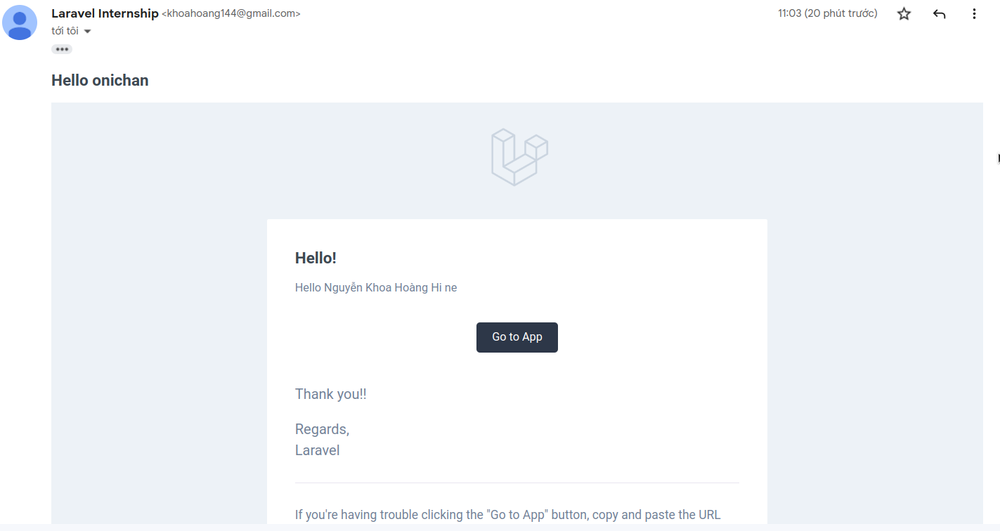

# I. Tìm hiểu về Notification
- Notification là một tin nhắn, thông điệp được gửi cho người dùng nhằm thông báo một thông tin, trạng thái tới email hay là trên thanh trạng thái ở trên cùng của web.
- Để tạo một notification với lệnh
```
php artisan make:notification ConfirmAccount
```
## 1. Mail Notifications
- Để gửi một Mail Notification mặc định của Laravel thì ta định nghĩa trong phương thức toMail trong class Notification vừa định nghĩa
```
    public function toMail($notifiable)
    {
        return (new MailMessage)
            ->line(view('mail.hello')->with([
                'user' => $this->user
            ]))
            ->action('Go to App', 'localhost:8000/home')
            ->line('Thank you!!');
    }
```

- Để chỉnh sửa file Mail mặc định này ta dùng lệnh và chỉnh sửa trong folder resources/views/vendor/notifications
```
    php artisan vendor:publish --tag=laravel-notifications
```

- Để tùy chỉnh file Mail riêng của mình ta sử dụng
```
    public function toMail($notifiable)
    {
        return (new MailMessage)->view('mail.hello', [
            'user' => $this->user
        ]);
    }
```

- Để thực hiện 1 Notification ta dùng lệnh sau gửi cho người dùng hiện tại, hay bất cứ người dùng nào tùy chỉnh ở Auth::user()
```
Notification::send(Auth::user(), new UserFollowNotification($user));
```

- Kết quả Email nhận được



## 2. Markdown Notifications
- Là Mail Notifications nhưng mà dùng template markdown 
- Tạo ra bằng lệnh
```
php artisan make:notification InvoicePaid --markdown=mail.invoice.paid
```
- Để gửi một Markdown Notification mặc định của Laravel thì ta định nghĩa trong phương thức toMail trong class Notification vừa định nghĩa
```
    public function toMail($notifiable)
    {
        return (new MailMessage)->markdown('mail.invoice.paid');
    }
```

- Để chỉnh sửa file Markdown Mail mặc định này ta dùng lệnh và chỉnh sửa trong folder resources/views/vendor/notifications/
```
    php artisan vendor:publish --tag=laravel-notifications
```

- Table component cho phép bạn chuyển đổi một Markdown table thành một HTML table. Các component chấp nhận Markdown table làm nội dung của nó. Căn lề table được hỗ trợ bằng cách sử dụng cú pháp căn chỉnh Markdown table mặc định:
```
    @component('mail::table')
    | Laravel       | Table         | Example  |
    | ------------- |:-------------:| --------:|
    | Col 2 is      | Centered      | $10      |
    | Col 3 is      | Right-Aligned | $20      |
    @endcomponent
```
- Kết quả Markdown Mail


## 3. Database Notifications
- Dùng để lưu thông tin của thông báo vào db và hiển thị ra lại cho người dùng
- Dùng lệnh sau để tạo ra bảng notifications trong db
```
php artisan notifications:table

php artisan migrate
```

- Tại phương thức via của file Notification ta định nghĩa như sau để có thể dùng được Database Notifications
```
    public function via($notifiable)
    {
        return ['database'];
    }
```

- Tại phương thức toArray ta định nghĩa để lưu được các dữ liệu dưới dạng file Json trong db
```
    return [
        'user_id' => $this->user['id'],
        'name' => $this->user['name'],
        'email' => $this->user['email'],
    ];
```
- Dữ liệu được lưu như sau tại cột data


- Để lấy được tất cả dữ liệu Notifications của 1 người dùng ta sử dụng
```
    $user = App\User::find(1);

    foreach ($user->notifications as $notification) {
        echo $notification->type;
    }
```

- Phương thức unreadNotifications để lấy các notifications có cột read_at là null và phương thức readNotifications là ngược lại

- Để đánh dấu Notification đã đọc ta dùng lệnh sau và cột read_at sẽ lưu lại thời gian đánh dấu
```
    $user = App\User::find(1);

    foreach ($user->unreadNotifications as $notification) {
        $notification->markAsRead();
    }
    // hoặc
    $user->unreadNotifications->markAsRead();
```

- Để xóa hết notifications của 1 user
```
$user->unreadNotifications->markAsRead();
```

- Kết quả của Database Notification


## 4. Slack Notifications
- Để gửi dữ liệu lên thông qua Slack thì ta phải cài thư viện
```
composer require laravel/slack-notification-channel
```

- Để sử dụng Slack Notifications ta định nghĩa hàm via như sau
```
    public function via($notifiable)
    {
        return ['slack'];
    }
```

- Và gửi 1 Slack Message tới Slack channel qua hàm toSlack
```
    public function toSlack($notifiable)
    {
        return (new SlackMessage)->content($this->user['name'] . 'Started Following you!!');
    }
```

- Để gửi Slack đến 1 channel thích hợp thì ta định nghĩa hàm routeNotificationForSlack tại model User như sau

```
    <?php

    namespace App;

    use Illuminate\Notifications\Notifiable;
    use Illuminate\Foundation\Auth\User as Authenticatable;

    class User extends Authenticatable
    {
        use Notifiable;

        /**
        * Route notifications for the Slack channel.
        *
        * @return string
        */
        public function routeNotificationForSlack()
        {
            return $this->slack_webhook_url;
        }
    }
```

- Lấy slack_webhook_url tại web Slack tương ứng với từng channel


- Kết quả Slack Notification


## 5. SMS Notifications
- SMS Notifications là thông báo SMS gửi đến số điện thoại, cần phải cài đặt theo lệnh
```
    composer require laravel/vonage-notification-channel guzzlehttp/guzzle
```

- Cấu hình VONAGE_KEY và VONAGE_SECRET theo web Vonage cung cấp trong file .env


- Và VONAGE_SMS_FROM để cho biết tin nhắn được gửi từ số điện thoại nào
```
VONAGE_SMS_FROM=84773412924
```

- Dùng dịch vụ sms notification bằng cách định nghĩa hàm via như sau
```
    public function via($notifiable)
    {
        return ['vonage'];
    }
```

- Và định nghĩa content tin nhắn muốn gửi đến ở hàm toVonage
```
    /**
    * Get the Vonage / SMS representation of the notification.
    *
    * @param  mixed  $notifiable
    * @return \Illuminate\Notifications\Messages\VonageMessage
    */
    public function toVonage($notifiable)
    {
        return (new VonageMessage)
                    ->content('Your SMS message content');
    }
```

- Sau đó tại hàm routeNotificationForVonage ở Model User return về số điện thoại của người dùng hiện tại nhận được tin nhắn
```
    public function routeNotificationForVonage($notification)
    {
        return $this->phone_number;
    }
```

# II. Questions
## Notification có dùng queue không?
- Có dùng được bằng cách implements ShouldQueue vào class và use Queueable.
- Sau đó khai báo các biến như delay, timeout, tries như bình thường.


  


