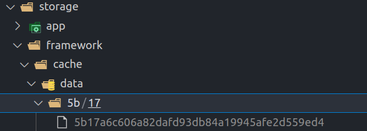

# I. Tìm hiểu về Cache
- Cache là bộ nhớ đệm, vùng lưu trữ tạm thời trong máy tính. Nó khác với cookie ở chỗ thông tin lưu trữ ở đây là các tài liệu web, các hình ảnh, các video, HTML, ....
- Mặc định cache sẽ được lưu trữ dưới dạng các file ở thư mục **storage/framework/cache/data**



- Để lưu cache trong database ta tạo ra bảng cache bằng lệnh
```
    php artisan cache:table
```

- Bảng cache sẽ có 3 cột key, value, expiration
  
# II. Các thao tác với Cache
- Để truy xuất các Cache ở nhiều store khác nhau như file, database, redis, memcached ta dùng hàm store
```
    $value = Cache::store('file')->get('foo');

    Cache::store('redis')->put('bar', 'baz', 10);
```

- Thêm Cache, nhưng nếu đã có Cache có key đưa vào tồn tại thì xóa Cache đó đi và thêm mới, 
    + Tham số 1: Key của Cache
    + Tham số 2: Value của Cache, như là các instance của 1 model, file, html,..
    + Tham số 3: Thời gian Cache đó hết hạn
```
    Cache::put('cacheKey', 'This should be a cache key', now()->addSecond(10));
```

- Thêm Cache nhưng nếu chưa có Cache có key đó thì mới thêm, còn có rồi thì không thêm
```
    Cache::add('cacheKey', 'This should be a cache key 2', now()->addSecond(10));
```

- Thêm Cache mãi mãi, không bao giờ hết hạn
```
    Cache::forever('cacheKey2', 'never hết hạn');
```

- Xóa từng Cache theo key
```
    Cache::forget('cacheKey2');
```

- Xóa hết tất cả các Cache
```
    Cache::flush();
```

- Lấy giá trị của Cache có key nào đó
```
    $value = Cache::get('cacheKey2');
```

- Kiểm tra xem Cache có tồn tại hay không
```
    if (Cache::has('cacheKey2')) {
        dd('Cache does exist');
    }
```

- Tăng, giảm giá trị trong Cache nhưng chỉ áp dụng với Cache nào có value là số nguyên, nếu Cache đó không chứa giá trị nguyên thì thay thế value đó thành số truyền vào.
```
    Cache::put('cacheKey2', 2);
    Cache::increment('cacheKey2', 4);
    Cache::decrement('cacheKey2', 4);
```

- Nếu đã có Cache sẵn thì lấy, còn không thì lưu giá trị vào Cache
```
    $comments = Cache::remember('comments', $minutes ,function () {
        return Comment::get();
    });
```

- Cũng như remember nhưng mà lưu vĩnh viễn, không hết hạn
```
    $comments = Cache::rememberForever('comments', function () {
        return Comment::get();
    });
```

- Lấy Cache đó rồi xóa cache đó luôn
```
    $comments = Cache::pull('comments');
```

# III. Vì sao nên dùng cache trong application?
- Để không mất thời gian xử lý yêu cầu vì đã có dữ liệu lưu sãn ở máy.
- Giảm thiểu chi phí mạng, mức sử dụng CPU ở nhiều request đòi hỏi các xử lý phức tạp
- Giúp kéo dài tuổi thọ máy móc hoặc máy chủ