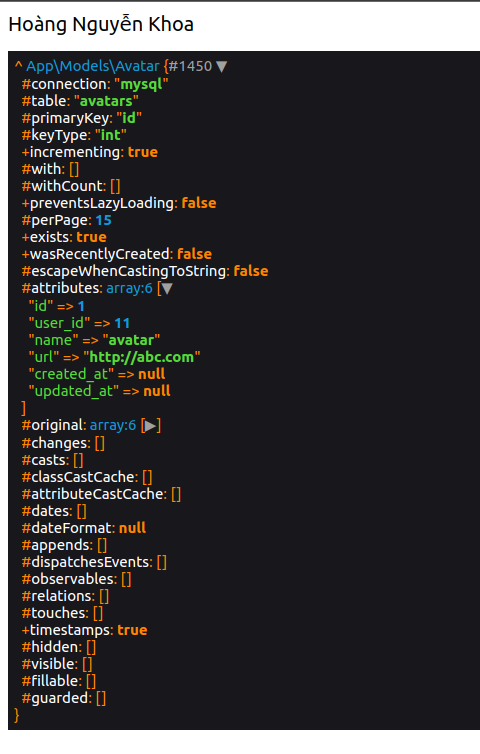

<h1>Tất cả các loại Relationship trong Laravel</h1>

# Mối quan hệ One to One
- One to One là một đối tượng cha sở hữu duy nhất 1 đối tượng con, và một con thuộc về duy nhất 1 cha.
- Ở đây có một bảng Avatar được khởi tạo như sau

```
    Schema::create('avatars', function (Blueprint $table) {
        $table->id();
        $table->unsignedBigInteger('user_id');
        $table->string('name');
        $table->string('url');
        $table->timestamps();
    });
```

- Và một Bảng User

```
    Schema::create('users', function (Blueprint $table) {
        $table->id();
        $table->string('name');
        $table->string('email')->unique();
        $table->string('password');
        $table->timestamps();
    });
```

- Ta có một User sẽ chỉ có 1 Avatar và 1 Avatar sẽ chỉ thuộc về 1 User

- Để có thể kết nối được 2 bảng, ở Model User ta khai báo hàm avatar gọi tới hàm hasOne(có một cái gì đó) như sau, và truyền các khóa chính, khóa ngoại cần thiết nếu bạn không đặt đúng tên mặc định

```
    <?php
    
    namespace App\Models;
    
    use Illuminate\Database\Eloquent\Model;
    
    class User extends Model
    {
        public function avatar()
        {
            // Cách 1: nếu khóa ngoại ở lớp Avatar bạn đặt đúng mặc định là <tên bảng chính viết thường không s>_id và khóa chính ở lớp Avatar là id thì không cần phải khai báo các thông tin tham số ở phía sau.
            // return $this->hasOne(Avatar::class);

            // Cách 2: Truyền vào tên tham số theo thứ tự là Model con, khóa ngoại của bảng cha tại bảng con và khóa chính của bảng con
            return $this->hasOne(Avatar::class, 'user_id', 'id');
        }
    }
```

- Để xác định mối quan hệ ngược lại, ở bảng Avatar ta khai báo hàm user gọi tới hàm belongTo(thuộc về 1 cái gì đó)

```
    <?php

    namespace App\Models;

    use Illuminate\Database\Eloquent\Factories\HasFactory;
    use Illuminate\Database\Eloquent\Model;

    class Avatar extends Model
    {
        use HasFactory;
        protected $guarded = [];

        public function user()
        {
            // Tham số theo thứ tự là: Model cha, khóa ngoại của bảng cha tại bảng con, và khóa chính của bảng cha. 
            return $this->belongsTo(User::class, 'user_id', 'id');
        }
    }
```

- Cách để lấy thông tin của của 2 đối tượng
```
    $user = User::find(11);
    $avatar = Avatar::find(1);

    echo $avatar->user->name;
    dd($user->avatar);
```

- Kết quả lấy được



# Mối quan hệ One to Many

- One to Many là mối quan hệ mà 1 đối tượng cha sở hữu nhiều đối tượng con, và 1 đối tượng con sở hữu về duy nhất 1 đối tượng cha

- Ở đây ta khởi tạo 1 bảng Post như sau:
```
    Schema::create('posts', function (Blueprint $table) {
        $table->id();
        $table->unsignedBigInteger('user_id');
        $table->string('name');
        $table->string('description');
        $table->longText('content');
        $table->timestamps();
    });
```

- Ta sẽ có một User sẽ sở hữu nhiều Post và 1 Post chỉ thuộc về 1 User

- Ở Model User ta định nghĩa hàm posts gọi tới hàm hasMany(Có nhiều cái gì đó) như sau:
```
    public function posts()
    {
        // Truyền vào tên tham số theo thứ tự là Model con, khóa ngoại của bảng cha tại bảng con và khóa chính của bảng con
        return $this->hasMany(Post::class, 'user_id', 'id');
    }
```

- Để xác định mối quan hệ ngược lại, ở bảng Post ta khai báo hàm user gọi tới hàm belongTo(thuộc về 1 cái gì đó)
```
    public function user()
    {
        // Tham số theo thứ tự là: Model cha, khóa ngoại của bảng cha tại bảng con, và khóa chính của bảng cha. 
        return $this->belongsTo(User::class, 'user_id', 'id');
    }
```

- Cách để lấy thông tin của 2 đối tượng
```
    $user = User::find(11);
    $post = Post::find(1);

    echo $post->user->name;

    // Trả về 1 mảng các Post thuộc User này
    dd($user->posts);
```

# Mối quan hệ Many to Many

- Many to Many là mối quan hệ mà một đối tượng cha sẽ có nhiều đối tượng con, mà 1 đối tượng con cũng sẽ thuộc nhiều lớp cha.

- Ta có một bảng Category như sau
```
    Schema::create('categories', function (Blueprint $table) {
        $table->id();
        $table->string('name');
        $table->timestamps();
    });
```

- Và một bảng trung gian giữa Category và Post là category_post như sau và bảng trung gian này không cần tạo model trong app Laravel để sử dụng mà chỉ cần tạo bảng trong db để lấy dữ liệu thôi là đủ:
```
    Schema::create('category_post', function (Blueprint $table) {
        $table->id();
        $table->unsignedBigInteger('category_id');
        $table->unsignedBigInteger('post_id');
        $table->string('value')->nullable();
        $table->timestamps();
    });
```

- Ta sẽ có 1 Category sẽ chứa nhiều Post và 1 Post sẽ thuộc về nhiều Category

- Tại vì ở mối quan hệ này thì cha con đều ở cùng tầng, nghĩa là lớp này thuộc nhiều lớp kia và lớp kia cùng thuộc nhiêu lớp này

- Vậy nên ở trên Model Category ta khai báo phương thức posts gọi tới hàm belongsToMany như sau

```
    public function posts()
    {
        /**
         * Tham số truyền vào lần lượt là:
         * - Model lớp cần kết nối
         * - Tên Bảng trung gian
         * - Khóa ngoại ở bảng trung gian của Model hiện tại (Model Category)
         * - Khóa ngoại ở bảng trung gian của Model lớp cần kết nối (Model Post)
         * - Khóa chính ở Model hiện tại
         * - Khóa chính ở Model cần kết nối
         */
        return $this->belongsToMany(Post::class, 'category_post', 'category_id', 'post_id', 'id', 'id');
    }
```

- Và ở Model Post ta khai báo phương thức categories cũng gọi tới hàm belongsToMany như sau:

```
    public function categories()
    {
        return $this->belongsToMany(Category::class, 'category_post', 'post_id', 'category_id', 'id', 'id');
    }
```

- Để lấy được thông tin khác của bảng trung gian, ta truyền tên cột cần lấy của bảng trung gian vào hàm withPivot hay là thông tin timestamps với hàm withTimestamps như sau:

```
    return $this->belongsToMany(Category::class, 'category_post', 'post_id', 'category_id', 'id', 'id')
                ->withPivot('value')
                ->withTimestamps();
```

- Cách để lấy thông tin của 2 đối tượng
```
        $category = Category::find(1);
        $post = Post::find(1);
        dd($post->categories);
        dd($category->posts);
```

- Lấy thông tin các cột ở bảng trung gian thông qua pivot
```
    $post = Post::find(1);
    foreach ($post->categories as $category) {
        echo $category->pivot->value . "<br>";
    }
```

# Mối quan hệ Has One Through
- Mối quan hệ Has One Through xác định mối quan hệ 1-1 với một mô hình khác nhưng mà là thông qua một mô hình thứ 3
  
- Ở đây ta có một bảng User như sau:
```
    Schema::create('users', function (Blueprint $table) {
        $table->id();
        $table->string('name');
        $table->string('email')->unique();
        $table->string('password');
        $table->timestamps();
    });
```

- Một bảng Category như sau
```
    Schema::create('categories', function (Blueprint $table) {
        $table->id();
        $table->string('name');
        $table->timestamps();
        $table->unsignedBigInteger('user_id')->nullable();
    });
```

- Một bảng Post như sau
```
    Schema::create('posts', function (Blueprint $table) {
        $table->id();
        $table->string('name');
        $table->string('description');
        $table->longText('content');
        $table->unsignedBigInteger('category_id')->nullable();
        $table->timestamps();
    });
```

- Ở đây, một User sẽ sở hữu một Category, và một Category sẽ chứa 1 Post. Mặc dù User và Post không có mối quan hệ trực tiếp trong db nhưng User có thể truy cập đến Post thông qua Model Category

- Ở Model User ta khai báo phương thức categoryPost gọi tới hàm hasOneThrough như sau

```
    public function categoryPost()
    {
        /**
         * Tham số truyền vào lần lượt là:
         * - Bảng con
         * - Bảng trung gian kết nối với bảng con
         * - Khóa ngoại của bảng cha ở bảng trung gian
         * - Khóa ngoại của bảng trung gian ở bảng con
         * - Khóa chinh của bảng cha
         * - Khóa chính của bang trung gian
         */
        return $this->hasOneThrough(Post::class, Category::class, 'user_id', 'category_id', 'id', 'id');
    }
```

- Để lấy thông tin của bảng con từ bảng cha
```
    $user = User::find(11);
    dd($user->categoryPost);
```

# Has Many Through
- Tương tự như Has One Through nhưng ở đây bảng cha chứa nhiều bảng con thông qua 1 Model trung gian khác

- Cho 3 bảng User Category Post như ở Has One Through, nhưng ở đây thì 1 User có thể có nhiều Post thông qua bảng trung gian Category

- Ở Model User ta khai báo phương thức categoryPosts gọi tới hàm hasManyThrough như sau, tham số truyên vào tương tự như ở Has One Through
```
    public function categoryPosts()
    {
        return $this->hasManyThrough(Post::class, Category::class);
    }
```

- Lấy thông tin các đối tượng con từ đối tượng cha
```
    $user = User::find(11);
    dd($user->categoryPosts);
```

# Has One Of Many
- Has One Of Many cho phép lấy một đối tượng trong nhiều đối tượng như lấy đối tượng mói nhất, cũ nhất bằng cách sau:

```
    public function latestOrder()
    {
        return $this->hasOne(Order::class)->latestOfMany();
    }

    public function oldestOrder()
    {
        return $this->hasOne(Order::class)->oldestOfMany();
    }
```

# Polymorphic Relationships
- Polymorphic Relationships hay còn gọi là mối quan hệ đa hình, cho phép 1 model thuộc về nhiều hơn 1 model khác

# One To One (Polymorphic)
- Quan hệ 1-1 đa hình cho phép 2 hoặc nhiều lớp cha sỡ hữu chung 1 lớp con
- Ở đây ta có một Bảng User như sau:
```
    Schema::create('users', function (Blueprint $table) {
        $table->id();
        $table->string('name');
        $table->string('email')->unique();
        $table->string('password');
        $table->timestamps();
    });
```

- Một bảng Post như sau:
```
    Schema::create('posts', function (Blueprint $table) {
        $table->id();
        $table->string('name');
        $table->string('description');
        $table->longText('content');
        $table->timestamps();
    });
```

- Và một bảng Image dùng chung cho cả User và Post như sau:
```
    Schema::create('images', function (Blueprint $table) {
        $table->id();
        $table->string('url');
        $table->morphs('imageable');
        $table->timestamps();
    });
```

- Ở đây bảng images sẽ tạo tự động ra 2 cột imageable_id và imageable_type, imageable_id sẽ chứa Id của lớp cha chứa nó và imageable_type chứa tên model của lớp cha chứa nó như là App\Models\Post hay App\Models\User

- Vì đây là mối quan hệ 1-1 nên 1 User sở hữu 1 Image, 1 Post sở hữu 1 Image và 1 Image thuộc về 1 User hoặc 1 Post

- Ở Model Image ta khai báo phương thức imageable gọi tới hàm morphTo để xác định lớp Image chính là lớp dùng chung cho nhiều model khác
```
    <?php
    
    namespace App\Models;
    
    use Illuminate\Database\Eloquent\Model;
    
    class Image extends Model
    {
        /**
        * Get the parent imageable model (user or post).
        */
        public function imageable()
        {
            return $this->morphTo();
        }
    }
```

- Ở Model User và Post ta khai báo hàm image gọi tới hàm morphOne để cho biết 1 User hoặc 1 Post sở hữu 1 Image

```
    public function image()
    {
        return $this->morphOne(Image::class, 'imageable');
    }
```

- Cách để lấy thông tin

```
        // Lấy thông tin Image từ User or Post
        $user = User::find(11);
        dd($user->image);

        $post = Post::find(1);
        dd($post->image);


        // Lấy thông tin User or Post từ Image
        $image = Image::find(2);
        dd($image->imageable);
```

# One To Many (Polymorphic)
- Quan hệ 1-nhiều đa hình, 2 hoặc nhiều lớp cha sỡ hữu nhiều đối tượng của chung 1 lớp con

- Ta có 1 bảng Post như sau:
```
    Schema::create('posts', function (Blueprint $table) {
        $table->id();
        $table->string('name');
        $table->string('description');
        $table->longText('content');
        $table->timestamps();
    });
```

- 1 Bảng Image như sau:
```
    Schema::create('images', function (Blueprint $table) {
        $table->id();
        $table->string('url');
        $table->timestamps();
    });
```

- Và 1 bảng Comment như sau;
```
    Schema::create('comments', function (Blueprint $table) {
        $table->id();
        $table->string('content');
        $table->morphs('commentable');
        $table->timestamps();
    });
```

- Ta có 1 Post hay 1 Image sỡ hữu nhiều Comment

- Tương tự ở 1-1 đa hình, tại Model Comment ta khai báo hàm commentable gọi tới morphTo như sau
```
    public function commentable()
    {
        return $this->morphTo();
    }
```

- Và ở model Post và Image ta khai báo phương thức comments gọi tới hàm morphMany như sau để cho biết 1 Post hoặc 1 Image sỡ hữu nhiều Comment
```
    public function comments()
    {
        return $this->morphMany(Comment::class, 'commentable');
    }
```

- Cách để lấy thông tin

```
        // Lấy thông tin Comment từ Image or Post
        $image = Image::find(1);
        dd($image->comments);

        $post = Post::find(1);
        dd($post->comments);


        // Lấy thông tin Image or Post từ Comment
        $comment = Comment::find(2);
        dd($comment->commentable);
```

# Many To Many (Polymorphic)
- Mối quan hệ nhiều-nhiều đa hình tương tự như 1-1 hình hoặc 1-nhiều đa hình. 2 hoặc nhiều lớp cha khác nhau sỡ hữu nhiều đối tượng chung 1 lớp con, và 1 đối tượng của lớp con thuộc về nhiều đối tượng cha ở các lớp khác nhau.

- Ở đây ta tạo ra 2 bảng Post, Category và Tag với các cột là ID và Name

- Sau đó tạo ra 1 bảng taggables trung gian để kết nối Bảng Post hoặc Category với bảng Tag, tương tự như mối quan hệ nhiều nhiều bình thường là cũng cần có 1 bảng trung gian như vậy

```
    Schema::create('taggables', function (Blueprint $table) {
        $table->id();
        $table->unsignedBigInteger('tag_id');
        $table->morphs('taggable');
        $table->timestamps();
    });
```

- Ở model Tag ta khai báo 2 phương thức posts và categories gọi tới hàm morphedByMany để có thể kết nối tới 2 model Post hoặc Category

```
    public function posts()
    {
        return $this->morphedByMany(Post::class, 'taggable');
    }

    public function categories()
    {
        return $this->morphedByMany(Category::class, 'taggable');
    }
```

- Ở 2 model Post và Category ta khai báo phương thức tags gọi tới hàm morphToMany để kết nối chung tới model Tag
  
```
    public function tags()
    {
        return $this->morphToMany(Tag::class, 'taggable');
    }
```

- Có thể sử dụng hàm withPivot để lấy thông tin cột khác ở bảng trung gian taggable

- Cách để lấy thông tin
```
    $category = Category::find(1);
    $post = Post::find(2);
    $tag = Tag::find(1);


    dd($tag->categories);
    dd($post->tags);
    dd($category->tags);
```


