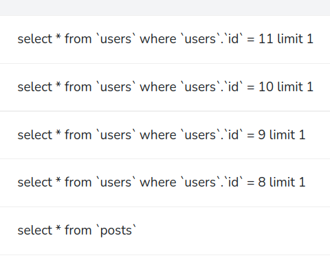
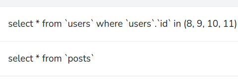
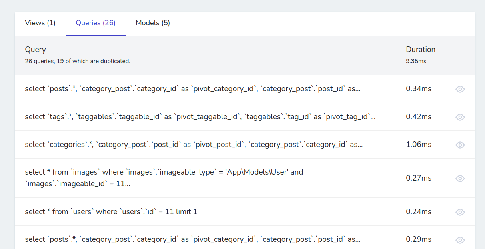
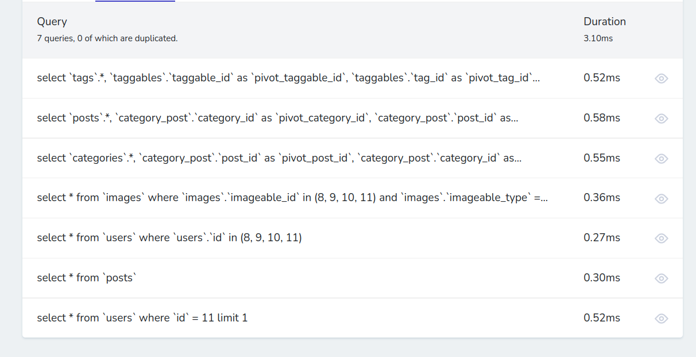

# Eager Loading trong Laravel
- Eager Loading trong Laravel hiểu đơn giản là làm giảm thiểu tối đa số câu truy vấn cần thiết cho chương trình

- Với hàm with được cung cấp ta có thể giảm số lượng câu truy vấn từ N+1 câu truy vấn thành 2 câu truy vấn

## Ví dụ như sau:

- Model Post thuộc về Model User thông qua hàm belongsTo như sau
```
    <?php

    namespace App\Models;

    use Illuminate\Database\Eloquent\Factories\HasFactory;
    use Illuminate\Database\Eloquent\Model;

    class Post extends Model
    {
        use HasFactory;
        protected $guarded = [];

        public function user()
        {
            return $this->belongsTo(User::class, 'user_id', 'id');
        }
    }
```

- Sau đó ta truy vấn như bình thường để lấy tất cả các post sau đó truyền vào blade để hiển thị ra
```
    public function allPost()
    {
        $posts = Post::all();
        return view('relationship.allPost', compact('posts'));
    }
```

- Ở blade ta lấy tên của tất cả các Post và tên của User sỡ hữu Post đó như sau
```
    All posts
    <br>
    @foreach ($posts as $post)
        {{ $post->name }} - {{ $post->user->name }} 
        <br> <br>
    @endforeach
```

- Thì kết quả chương trình vẫn chạy bình thường nhưng số lượng câu truy vấn sẽ là N+1 với N là số lượng Post

    + Câu truy vấn đầu tiên là lấy ra hết tất cả các Post
    + N câu truy vấn tiếp theo là chọn ra từng user sỡ hữu các Post đó

- Như vậy nếu có 1 triệu Post thì chắc chắn chương trình sẽ bị chậm, đơ.
  
- Bây giờ chúng ta sẽ chỉnh sửa hàm getAllPost bằng cách sử dụng with như sau:
```
    public function allPost()
    {
        $posts = Post::with('user')->get();
        return view('relationship.allPost', compact('posts'));
    }
```

- Trong hàm with chúng ta sẽ truyền các mối quan hệ của Post vào trong đây, ở đây là 'user' là tên của mối quan hệ ta đã khai báo trong Model Post

- Kết quả thực hiện vẫn trả về như cũ, nhưng số lượng câu truy vấn đã giảm thiểu lại chỉ còn 2

    

    + Một truy vấn lấy tất cả các Post
    + Một truy vấn lấy tất cả các User của các Post

- Như vậy cho dù nếu có 1 triệu Post thì số lượng câu truy vấn vẫn là 2, có thể làm chương trình hoạt động nhanh hơn, tránh bị đơ, chậm.

## Eager Loading nhiều mối quan hệ cùng 1 lúc
- Đôi khi ta sẽ cần tải 1 lúc nhiều quan hệ của một Model thay vì 1 quan hệ thì ta chỉ cần đưa các tên quan hệ đó vào 1 cái mảng
```
    public function allPost()
    {
        $posts = Post::with(['user', 'categories'])->get();
        return view('relationship.allPost', compact('posts'));
    }
```

## Eager Loading các mối quan hệ lồng nhau
- Để tải các mối quan hệ của mối quan hệ, ta sử dụng dấu chấm để tải tiếp mối quan hệ của nó
- Ví dụ ở đây bảng Post cần tải mối quan hệ User, và trong User có mối quan hệ với Image, ta khai báo như sau
```
    public function allPost()
    {
        $posts = Post::with('user.image')->get();
        return view('relationship.allPost', compact('posts'));
    }
```

- Với nhiều mối quan hệ con thì thay vì dấu chấm ta sẽ đưa nó vào 1 mảng
```
    public function allPost()
    {
        $posts = Post::with([
            'user' => [
                'image',
                'avatar',
            ],
        ])->get();
        return view('relationship.allPost', compact('posts'));
    }
```
## Eager Loading các cột cần thiết
- Đôi khi ta chỉ cần lấy ra thông tin của một vài cột cần thiết của 1 row để cho tiết kiệm thời gian chạy thì ta khai báo như sau
```
$posts = Post::with('user:id,name')->get();
```

- Hoặc ít hơn nữa là chỉ lấy số lượng, hay trung bình, min max,... của bảng thì ta dùng các hàm như 
```
    $posts = Post->withCount('categories')->get();
    $posts = Post->withAvg('views', 'count')->get();
    $posts = Post->withMax('views', 'count')->get();
    $posts = Post->withMin('views', 'count')->get();
```

## Eager Loading với các ràng buộc điều kiện
- Khi ta muốn tải các mối quan hệ nhưng kèm theo các điều kiện cho các mối quan hệ đó.

- Ví dụ tải mối quan hệ categories của Model Post mà chỉ chứa những Category có user_id là 10
```
    $posts = Post::with([
        'categories' => function ($query) {
            $query->where('user_id', 10)->with('posts');
        }
    ])->get();
```

## Lazy Eager Loading
- Khi ta có sẵn danh sách các đối tượng và sau đó ta muốn tải các mối quan hệ trên các đối tượng có sẵn đó thì ta sẽ dùng hàm load như sau
```
    $posts = Post::all();

    // Giả sử phải trải qua một vài điều kiện thì mới load các mối quan hệ
    if(true){
        $posts = $posts->load('user.image');
    }
```

- Để tải các mối quan hệ chỉ khi nó chưa được tải thì ta dùng loadMissing
```
    $posts = $posts->loadMissing('user.image');
```

## Mặc định tự tải các mối quan hệ Eager Loading
- Khi ta muốn tự động tải các mối quan hệ khi nhận được 1 đối tượng của 1 Model nào đó thì ta khai báo tên của mối quan hệ đó trong biến $with đặt ở trong Lớp Model của nó

```
<?php

namespace App\Models;

// use Illuminate\Contracts\Auth\MustVerifyEmail;
use Illuminate\Database\Eloquent\Factories\HasFactory;
use Illuminate\Foundation\Auth\User as Authenticatable;
use Illuminate\Notifications\Notifiable;
use Laravel\Sanctum\HasApiTokens;

class User extends Authenticatable
{

    protected $with = ['posts','image'];

    public function posts()
    {
        return $this->hasMany(Post::class, 'user_id', 'id');
    }


    public function image()
    {
        return $this->morphOne(Image::class, 'imageable');
    }

}

```

- Nếu mà không muốn tự động load mối quan hệ nào đó mỗi khi nhận được Model thì ta dùng hàm without
```
    $user = User::without('image')->get();
```

- Nếu mà chỉ muốn load chỉ 1 mối quan hệ nào đó thì ta dùng hàm withOnly
```
    $user = User::withOnly('posts')->get();
```

## Nested Eager Loading morphTo Relationships
- Để tải các mối quan hệ lồng nhau của quan hệ đa hình thì ta khai báo với hàm morphWith như sau

- Ví dụ ở đây có Comment là bảng quan hệ dùng chung cho cả Post và Image:
```
    $comments = Comment::with(['commentable' => function (MorphTo $morphTo) {
        $morphTo->morphWith([
            Post::class => ['user'],
            Image::class
        ]);
    }])->get();
```

## Constraining Eager Loading Of morphTo Relationships
- Để tải các mối quan hệ lồng nhau của quan hệ đa hình nhưng kèm theo các điều kiện thì ta khai báo với hàm constrain như sau
```
    $comments = Comment::with(['commentable' => function (MorphTo $morphTo) {
        $morphTo->constrain([
            Post::class => function (Builder $query) {
                $query->where('category_id', 1);
            }
        ]);
    }])->get();
```

# Ví dụ tổng hợp
- Ở đây ta lấy ra các Post, từ các Post lấy ra được:
  + Tên từng Post
  + Tên User của từng Post
  + Url của Image thuộc sỡ hữu của User của từng Post
  + Lấy ra hết các Category có quan hệ nhiều nhiều với từng Post
  + Từ mỗi Category lấy ra các Tags có quan hệ nhiều nhiều và lấy ra name từng tag, và lấy name của tất cả các Post có quan hệ nhiều nhiều với từng Category

```
<!DOCTYPE html>
<html lang="en">
<head>
    <meta charset="UTF-8">
    <meta name="viewport" content="width=device-width, initial-scale=1.0">
    <meta http-equiv="X-UA-Compatible" content="ie=edge">
    <title>Document</title>
</head>
<body>
    All posts
    <br>
    @foreach ($posts as $post)
        {{ $post->name }} - {{ $post->user->name }} 
        - {{ $post->user->image->url }}
        <br>
        @foreach ($post->categories as $category)
            {{ $category->name }}
            @foreach ($category->tags as $tag)
                {{ $tag->name }}
            @endforeach
            <br>
            @foreach ($category->posts as $post2)
                {{ $post2->name }}
            @endforeach
        @endforeach
        {{-- {{ $post->categories_count }} --}}
        <br> <br>
    @endforeach
</body>
</html>
```

- Ở Controller, ta khai báo với hàm mặc định như sau
```
    public function allPost()
    {
        $posts = Post::all();
        return view('relationship.allPost', compact('posts'));
    }
```

- Thì kết quả sẽ cho ra 26 câu truy vấn như thế này



- Còn nếu dùng Eager Loading
```
    public function allPost()
    {
        $posts = Post::with([
            'user.image',
            'categories' => function ($query) {
                $query->whereNull('created_at')->with(['posts','tags']);
            }
        ])->get();
        return view('relationship.allPost', compact('posts'));
    }
```

- Thì kết quả sẽ cho ra chỉ 7 câu truy vấn như thế này

