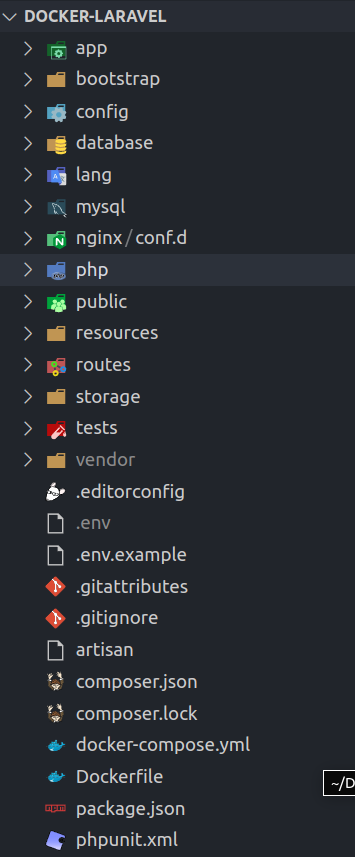
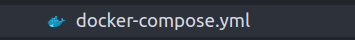
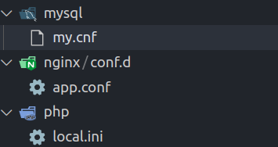

# I. Docker là gì?
- Docker có thể hiểu đơn giản cung cấp các công cụ để tạo ra một một máy ảo nhưng nhẹ hơn máy ảo thật như VirtualBox hay VNware.
- Docker có 2 khái niệm là Image và Container
    + Docker Image: là một gói bao gồm tất cả những thứ cần thiết để chạy một ứng dụng như mã nguồn, thư viện, a runtime, các biến môi trường và các file cấu hình.
        * Một image bao gồm hệ điều hành (Windows, CentOS, Ubuntu, …) và các môi trường lập trình được cài sẵn (httpd, mysqld, nginx, python, git, …).
        * Được pull từ Docker Hub bằng câu lệnh:
    ```
    docker pull image_name
    ```
    + Docker Container: là instance thực thi một image, tương tự như một máy ảo
<br>
- Ngoài ra còn có 2 khái niệm là Docker Volumne và Docker Network
    + Volume: dùng để chia sẻ dữ liệu giữa máy chủ host và container với nhau. Dữ liệu cố định trên volume dù container có tự xóa.
    + Network: sẽ đảm nhiệm nhiệm vụ kết nối mạng giữa các container với nhau, kết nối giữa container với bên ngoài, cũng như kết nối giữa các cụm (swarm) docker containers.
    + Ví dụ về network có 3 contanier đang chạy là:
        * Container tên app được build từ image php
        * Container tên webserver được build từ image nginx
        * Container tên db được build từ image mysql
        * Có một network: app-network và cả 3 container đều kết nối chung 1 network này thì chúng ta sẽ tạo ra được 1 app dùng php, với server nginx và dùng database là mysql trong khi cả 3 container chạy riêng biệt.

# II. Docker-compose
- docker-compose là một công cu giúp định nghĩa và khởi chạy nhiều container cùng một lúc.
- Việc sử dụng Docker Compose được tóm lược trong 3 bước cơ bản sau:
    + Khai báo app’s environment với Dockerfile.
    + Khai báo các services cần thiết để chạy app trong docker-compose.yml.
    + Run docker-compose build và docker-compose up -d sau đó các container sẽ start và run app.
- Dockerfile là một file sẽ quy định Docker image được khởi tạo từ đâu, gồm những gì trong đó.
    + Dockerfile sẽ build thành một Docker image và sau khi run thì nó sẽ thành một Docker Contariner
- docker-compose.yml: Dùng để khai báo và điều phối hoạt động của các container trong project.
# Ví dụ tổng quan về dùng docker thông qua docker-compose:
## [Link to Repository Docker-Laravel](https://github.com/NguyenKhoaHoang/Docker-Laravel)
### Tại một app laravel có cấu trúc như thế này:


<br>

   ### Có file docker-compose.yml như sau với nội dung như thế này để khai báo và điều phối các container 
   
   <br>

```
# Sử dụng sersion 3 của docker compose
version: '3'
# Danh sách các services container
services:
  
  # PHP Service
  app:
    # Đường dẫn chỉ đến Dockefile để build image để chạy container app
    build:
      context: .
      dockerfile: Dockerfile

    # image sử dụng 
    image: digitalocean.com/php

    # tên container
    container_name: app

    # luôn luôn restart, trừ trường hợp container đã bị stoped.
    restart: unless-stopped

    # việc tạo container thưc hiện thông qua SSH, nếu ko add param này thì qua trình này sẽ bị exit và ko tạo đc container
    tty: true

    # khai báo các biến môi trường.
    environment:
      SERVICE_NAME: app
      SERVICE_TAGS: dev

    # Thư mục làm việc
    working_dir: /var/www

    # Chia sẽ dữ liệu giữa máy chủ host và container
    # Trước dấu : là đường dẫn thư mục muốn chia sẻ của host
    # Sau dấu : là đường dẫn thư mục muốn chia sẻ của container, dữ liệu sẽ không bị mất khi xóa container
    volumes:
      - ./:/var/www
      - ./php/local.ini:/usr/local/etc/php/conf.d/local.ini
    
    # Networks để các container có thể giao tiếp với nhau
    networks:
      - app-network

  #Nginx Service
  webserver:
    image: nginx:latest
    container_name: webserver
    restart: unless-stopped
    tty: true

    # Đăng ký cổng kết nối, khi ở máy thật truy cập tới cổng 8001 thì sẽ vào cổng 80 của máy ảo
    ports:
      - "8001:80"
      - "443:443"
    volumes:
      - ./:/var/www
      - ./nginx/conf.d/:/etc/nginx/conf.d/
    networks:
      - app-network

  #MySQL Service
  db:
    image: mysql:latest
    container_name: db
    restart: always
    tty: true
    ports:
      - "3309:3306"
    environment:
      MYSQL_DATABASE: testdb
      MYSQL_ROOT_PASSWORD: 123
      SERVICE_TAGS: dev
      SERVICE_NAME: mysql
    volumes:
      - dbdata:/var/lib/mysql/
      - ./mysql/my.cnf:/etc/mysql/my.cnf
    networks:
      - app-network

#Docker Networks
networks:
  app-network:
    driver: bridge
#Volumes
volumes:
  dbdata:
    driver: local
```

### Và có một Dockerfile để  build một image để chạy container app gồm những câu lệnh cấu hình 
   
   <br>

```
# Sử dụng image từ docker-hub
FROM php:8.1.0-fpm

# Copy composer.lock and composer.json
COPY composer.lock composer.json /var/www/

# Set working directory
WORKDIR /var/www

USER root
# Install dependencies
RUN apt-get update && apt-get install -y \
    build-essential \
    libpng-dev \
    libjpeg62-turbo-dev \
    libfreetype6-dev \
    locales \
    zip \
    jpegoptim optipng pngquant gifsicle \
    vim \
    unzip \
    git \
    curl

# Clear cache
RUN apt-get clean && rm -rf /var/lib/apt/lists/*

# Install extensions
RUN docker-php-ext-install pdo_mysql 
# mbstring zip exif pcntl
# RUN docker-php-ext-configure gd --with-gd --with-freetype-dir=/usr/include/ --with-jpeg-dir=/usr/include/ --with-png-dir=/usr/include/
RUN docker-php-ext-install gd

# Install composer
RUN curl -sS https://getcomposer.org/installer | php -- --install-dir=/usr/local/bin --filename=composer

# Add user for laravel application
# RUN groupadd -g 1000 www
# RUN useradd -u 1000 -ms /bin/bash -g www www

# Copy existing application directory contents
COPY . /var/www

# Copy existing application directory permissions
COPY --chown=www:www . /var/www

# Change current user to www
USER www

# Expose port 9000 and start php-fpm server
EXPOSE 9000
CMD ["php-fpm"]
```

### Sau đó là các file cấu hình tương ứng cho từng container 
   
   <br>

```
# file my.cnf
[mysqld]
general_log = 1
general_log_file = /var/lib/mysql/general.log
```

```
# file my.cnf
[mysqld]
general_log = 1
general_log_file = /var/lib/mysql/general.log
```

```
# file app.conf
server {
    # Server Lắng nghe ở cổng 80
    listen 80;

    # file chạy đầu tiên index
    index index.php index.html;
    error_log  /var/log/nginx/error.log;
    access_log /var/log/nginx/access.log;

    # thư mục chứa file chạy đầu tiên index
    root /var/www/public;
    location ~ \.php$ {
        try_files $uri =404;
        fastcgi_split_path_info ^(.+\.php)(/.+)$;
        fastcgi_pass app:9000;
        fastcgi_index index.php;
        include fastcgi_params;
        fastcgi_param SCRIPT_FILENAME $document_root$fastcgi_script_name;
        fastcgi_param PATH_INFO $fastcgi_path_info;
    }
    location / {
        try_files $uri $uri/ /index.php?$query_string;
        gzip_static on;
    }
}
```

```
# file local.ini
upload_max_filesize=40M
post_max_size=40M
```

```
# chỉnh các cấu hình mysql file .env của laravel để kết nối với container db

DB_CONNECTION=mysql
DB_HOST=db
DB_PORT=3306
DB_DATABASE=testdb
DB_USERNAME=root
DB_PASSWORD=123
```

## Sau khi viết các file cấu hình thì chạy lệnh dưới đây để build ra các contanier và khởi chạy chúng
```
docker-compose build
docker-compose up -d
```

## Sau đó vào đường dẫn tương ứng dẫn đến server là localhost:8001 

## Truy cập vào các container app hay mysql bằng lệnh
```
docker-compose exec app bash
# nếu là mysql với password là 123 như đã khai báo trong docker-compose.yml
docker-compose exec db bash
mysql -u root -p
```

## Có thể truy cập mysql của container db thông qua đường dẫn localhost:3309 như đã khai báo

## Như vậy là chúng ta không cần thiết phải cài php, nginx hay mysql trên máy chủ của mình để có thể chạy được app.

# III. Questions
## 1. Thay đổi 1 vài config với web server, làm thế nào để webserver cập nhật các config mới nhất?

- Thay đổi 1 vài config với webserver thì phải dùng lệnh này để có thể cập nhật các config mới nhất của webserver
```
docker-compose build webserver
docker-compose up -d
```

## 2. Vì sao webserver có thể điều hướng được các request tới workspace, trong khi nó nằm ở 2 container khác nhau?
- Tuy nó nằm ở 2 container khác nhau nhưng chúng lại ở cùng 1 network nên có thể điều hướng các request tới được với nhau

## 3. Network đóng vai trò gì trong việc sử dụng docker-compose?
- Network sẽ đảm nhiệm nhiệm vụ kết nối mạng giữa các container với nhau, kết nối giữa container với bên ngoài, cũng như kết nối giữa các cụm (swarm) docker containers.


