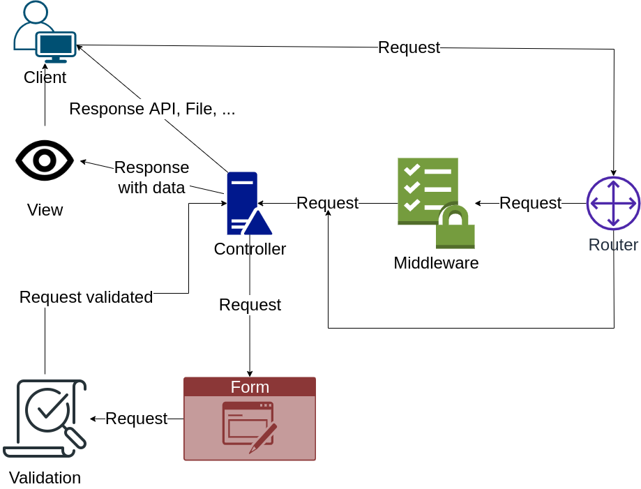
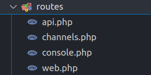

# I. Mối quan hệ giữa router, middleware, request, validation, response
## [Link to Repository Request Life Cycle](https://github.com/NguyenKhoaHoang/Request-Life-Cycle)

<br>
<br>

# II. Tìm hiểu về Router
- Router dùng để điều khiển các đường dẫn trên browser
- Router được viết trong thư mục routes/web.php - định nghĩa các route cho web, còn routes/api.php để định nghĩa route cho api.
- <br>
- 
- Các phương thức thường sử dụng trong Route
  + Tham số đầu tiên là đường liên kết mong muôn
  + Tham số thứ 2 là Controller tương ứng và phương thức thực hiện hàm đó hoặc có thể truyền thẳng một function vào cũng được.
  + Có thể đặt tên cho Route bằng phương thức name('nameRoute');
```
Route::get('/', [HomeController::class, 'index'])->name('home');

Route::get('/add', [HomeController::class, 'add'])->name('add');

Route::post('/store', [HomeController::class, 'store'])->name('store.store')->middleware('auth.admin');

Route::put('/store', [HomeController::class, 'edit'])->name('store.edit');

Route::delete('/store', [HomeController::class, 'delete'])->name('store.delete');
```

- Có thể truyền tham số tùy chọn vào 
```
Route::get('/post/{id}', function ($id) {
    return "Post co id la: " . $id;
});
```

- Ngoài ra còn có thể truyền nhiều tham số vào và lọc chúng theo biểu thức chính quy
```
Route::get('/news/{slug}-{id}.html', function ($slug = null, $id = null) {
    $content = 'id la: ' . $id . '<br>';
    $content .= 'slug la: ' . $slug;
    return $content;
})->where(
    [
        'slug' => '[a-z-]+',
        'id' => '[0-9]+'
    ]
)->name('admin.news');
```

- Nhóm các nhóm route lại với nhau bằng prefix thì các đường dẫn của các route này sẽ có tên tương ứng đứng trước:
```
Route->prefix('/admin')->group(function () {

    Route::get('/', [DashboardController::class, 'index']);

    Route::get('/post/{id}', function ($id) {
        return "Post co id la: " . $id;
    });

    Route::get('/food/{id?}', [HomeController::class, 'food']);

    Route::get('/news/{slug}-{id}.html', function ($slug = null, $id = null) {
        $content = 'id la: ' . $id . '<br>';
        $content .= 'slug la: ' . $slug;
        return $content;
    })->where(
        [
            'slug' => '[a-z-]+',
            'id' => '[0-9]+'
        ]
    )->name('admin.news');

    Route->get('/products', function () {
        return 'product admin';
    });

    Route::get('/categories', function () {
        return 'categories admin';
    });
});
```

# III. Tìm hiểu middleware
- Middleware lọc các request trước khi nó được thực hiện theo một điều kiện nào đó mà người dùng tự đặt ra
- Tạo một middleware
```
php artisan make:middleware CheckLoginAdmin
```
- File middleware mới được tạo ra nằm trong thư mục app/Http/Middleware và có nội dung sau:
```
<?php

namespace App\Http\Middleware;

use Closure;

class CheckLoginAdmin
{
    /**
     * Handle an incoming request.
     *
     * @param  \Illuminate\Http\Request  $request
     * @param  \Closure  $next
     * @return mixed
     */
    public function handle($request, Closure $next)
    {
        return $next($request);
    }
}
```

- Phương thức handle nhận 2 tham số $request từ người dùng truyền đến và một Closure $next
    + handle sẽ xử lý kiểm tra các thông tin được đưa đến.
    + return $next($request) sẽ cho phép $request đó tiếp tục truy cập.
    + Ví dụ kiểm tra xem user đã check in hay chưa:
```
public function handle(Request $request, Closure $next)
{
    if (Auth::check()) {
        return $next($request);
    }
    return redirect('home')->with('msg', 'Some error message');
}
```

- Để sử dụng được middleware đã khởi tạo thì phải khai báo trong file app/Http/Kernel.php tại phần $routeMiddleware như thế này:
```
protected $routeMiddleware = [
    'auth' => \App\Http\Middleware\Authenticate::class,
    'auth.basic' => \Illuminate\Auth\Middleware\AuthenticateWithBasicAuth::class,
    'auth.session' => \Illuminate\Session\Middleware\AuthenticateSession::class,
    'cache.headers' => \Illuminate\Http\Middleware\SetCacheHeaders::class,
    'can' => \Illuminate\Auth\Middleware\Authorize::class,
    'guest' => \App\Http\Middleware\RedirectIfAuthenticated::class,
    'password.confirm' => \Illuminate\Auth\Middleware\RequirePassword::class,
    'signed' => \Illuminate\Routing\Middleware\ValidateSignature::class,
    'throttle' => \Illuminate\Routing\Middleware\ThrottleRequests::class,
    'verified' => \Illuminate\Auth\Middleware\EnsureEmailIsVerified::class,
    'auth.admin' => CheckLoginAdmin::class,
];
```

- Nếu đưa middleware ta khởi tạo vào **protected $middleware** thì middleware trong phần này sẽ được áp dụng cho toàn bộ cái route có trong project
- Ngoài ra còn có phần **protected $middlewareGroups** được phân ra 2 phần danh cho route thuộc web và route thuộc api
- Sử dụng middleware cho các route tương ứng bằng cách dùng hàm middleware() cho nhóm route hoặc 1 route như sau:
```
// Nhóm các route lại với nhau
Route::middleware('auth.admin')->prefix('/admin')->group(function () {
    Route::get('/news/{slug}-{id}.html', function ($slug = null, $id = null) {
        $content = 'id la: ' . $id . '<br>';
        $content .= 'slug la: ' . $slug;
        return $content;
    })->where(
        [
            'slug' => '[a-z-]+',
            'id' => '[0-9]+'
        ]
    )->name('admin.news');

    Route::middleware('auth.admin.product')->get('/products', function () {
        return 'product admin';
    });

    Route::get('/categories', function () {
        return 'categories admin';
    });
});
```

# IV. Tìm hiểu về Validation
- Validation là một công cụ dùng để kiểm tra dữ liệu request được gửi lên có đúng yêu cầu hay không trước khi đưa vào xử lý các dữ liệu đó.
- Thường dùng ở các form nhập thông tin để bắt lỗi nhập sai dữ liệu của người dùng.
- Giả sử có một form nhập thông tin gửi thông tin tới Controller tại hàm store và nhận được dữ liệu qua biến $request như thế này:
```
public function store(Request $request)
{
    $content = 'Da add user: ' . $request->username . ' voi mat khau la: ' . $request->password;
    return $content;
}
```

- Cách để validate dữ liệu là tạo ra các (rules) luật đối với từng đối tượng mà request đưa tới và tùy chỉnh các thông báo lỗi khi xảy ra lỗi tương ứng
  + Cách 1:
```
$request->validate([
    'username' => 'required|min:2',
    'password' => 'required|min:5|integer'
], [
    'username.required' => 'Phai nhap :attribute',
    'username.min'=>'Username phai hon 2 ky tu',
    'password.required'=>'Phai nhap :attribute',
    'password.min'=>'Password phai hon 5 ky tu',
    'password.integer'=>'Password chi chua so'
]);
```
  + Cách 2: dùng biến :attribute để lấy luôn tên đặc trưng tương ứng với từng lỗi
```
$rules = [
    'username' => 'required|min:2',
    'password' => 'required|min:5|integer'
];
$messages = [
    'required' => ':attribute bat buoc phai nhap',
    'min' => ':attribute khong duoc nho hon :min ky tu',
    'integer' => ':attribute phai la so',
];
$request->validate($rules, $messages);
```
  + Cách 3: Dùng Form request tạo ra bằng lệnh: 
  php artisan make:request UserRequest

```
<?php

namespace App\Http\Requests;

use Illuminate\Foundation\Http\FormRequest;

class UserRequest extends FormRequest
{
    /**
     * Determine if the user is authorized to make this request.
     *
     * @return bool
     */
    public function authorize()
    {
        return true;
    }

    /**
     * Get the validation rules that apply to the request.
     *
     * @return array<string, mixed>
     */
    public function rules()
    {
        return [
            'username' => 'required|min:2',
            'password' => 'required|min:5|integer'
        ];
    }

    /**
     * Get the error messages for the defined validation rules.
     *
     * @return array
     */
    public function messages()
    {
        return [
            'required' => ':attribute bat buoc phai nhap',
            'min' => ':attribute khong duoc nho hon :min ky tu',
            'integer' => ':attribute phai la so'
        ];
    }

    /**
     * Get custom attributes for validator errors.
     *
     * @return array
     */
    public function attributes()
    {
        return [
            'username' => 'Tên đăng nhập',
            'password' => 'Mật khẩu'
        ];
    }
}
```
   Sau đó chỉnh Request trong store thành UserRequest để sử dụng được Form này
```
public function store(UserRequest $request)
    {
        $content = 'Da add user: ' . $request->username . ' voi mat khau la: ' . $request->password;
        return $content;
    }

```
- Khi mắc lỗi thì validate sẽ tự động hướng quay lại trang gửi request đến với các thông báo lỗi được hiển thị ra bằng cách dùng các hàm error()
```
{{-- Hiển thị hết tất cả các lỗi --}}
@if ($errors->any())
    <div class="alert alert-danger">
        <ul>
            @foreach ($errors->all() as $error)
                <li>{{ $error }}</li>
            @endforeach
        </ul>
    </div>
@endif

<form action="{{ route('store.store') }}" method="POST">
    @csrf
    <div>
        <input class="@error('username') is-invalid @enderror type="text" name="username" placeholder="nhap user name..." value="{{ old('username') }}">
        {{-- Hiển thị từng lỗi tương ứng --}}
        @error('username')
            <div class="alert alert-danger">{{ $message }}</div>
        @enderror
        <br>
        <input class="@error('password') is-invalid @enderror type="text" name="password" placeholder="Nhap mat khau..." value="{{ old('password') }}">
        @error('password')
        <div class="alert alert-danger">{{ $message }}</div>
        @enderror
    </div>
    <button type="submit">Submit add</button>
</form>
```

# V. Tìm hiểu về request
  - Request là các yêu cầu mà được gửi từ client đến serve
  - Các phương thức hỗ trợ của Request
    + Trả về thông tin đường dẫn
```
// ví dụ URL http://localhost:8001/category
$uri = $request->path();
echo $uri;
// kết quả trả về  "category"
```
- + Kiểm tra xem đường dẫn có khớp hay ko, dùng name/* để kiểm tra xem có trùng khớp tất cả
```
if ($request->is('category/*')) {
    // các đường dẫn bắt đầu bằng category/ được xử lý
    // ví dụ http://localhost:8001/category/create, http://localhost:8001/category/update
}
if ($request->is('category/create')) {
    echo "Đường dẫn bạn vừa truy nhập đúng là http://localhost:8001/category/create {$request->path()}";
}
```
- + Lấy full đường dẫn
```
// ví dụ ta có đường dẫn : http://localhost:8001/category?param=laravel (?param=laravel - query string)
$url = $request->fullUrl();
// trả về http://localhost:8001/category?param=laravel
```
- + Lấy hoặc kiểm tra method mà request truyền đến
```
$method = $request->method();
if ($request->isMethod('get')) {
    echo GET request';
} else {
    echo 'POST request';
}
```

- + Lấy thông tin từ form 
```
$name = $request->name;

// Kiểm tra có tồn tại email trong request hay không
if ($request->has('email')) {
    //
}

// Lấy hết tất cả dữ liệu
$input = $request->all();
```

# VI. Tìm hiểu về response
- Mỗi khi request gửi lên máy chủ thì sẽ trả về một response cho trình duyệt để thực hiện hoặc hiển thị các nội dung cho người dùng
- Trả về chuỗi
```
Route::get('/', function () {
    return 'Hello World';
});
```

- Trả về một mảng: Laravel tự động chuyển mảng hoặc collection thành dạng json
```
Route::get('/', function () {
    return ['a' => 1, 'b' =>  2, 'c' => 3];
});
```

- Trả về 1 Response instances cho phép bạn tùy chỉnh lại mã trạng thái và header của HTTP response.
```
Route::get('home', function () {
    return response('Hello World', 200)
        ->header('Content-Type', 'text/plain');
});
```

- Gắn Header vào Response
```
return response($content)
    ->withHeaders([
        'Content-Type' => $type,
        'X-Header-One' => 'Header Value',
        'X-Header-Two' => 'Header Value',
    ]);
```

- Gắn Cookie vào Response: $minutes là thời gian tồn tại của cookie theo phút
```
return response($content)
    ->header('Content-Type', $type)
    ->cookie('name', 'value', $minutes);
```

- Redirects
    + Chuyển hướng thẳng đến một URL khác hoặc là quay trờ lại trang trước đó
```
Route::get('dashboard', function () {
    return redirect('home');
});

Route::get('dashboard', function () {
    return redirect()->back();
});
```

- + Chuyển hướng theo tên của route và truyền tham số vào route đó
```
return redirect()->route('login');
return redirect()->route('profile', ['id' => 1]);
```

- + Chuyển hướng đến Controller 
```
return redirect()->action(
    'UserController@profile', ['id' => 1]
);
```

- + Chuyển hướng đến miền nào đó
```
return redirect()->away('https://www.google.com');
```

- + Chuyển hướng cùng với thông báo
```
Route::post('user/profile', function () {
    // Update the user's profile...

    return redirect('dashboard')->with('status', 'Profile updated!');
});
```
Nhận thông báo
```
@if (session('status'))
    <div class="alert alert-success">
        {{ session('status') }}
    </div>
@endif
```

- + Chuyển hướng tới một view
```
return response()
    ->view('hello', $data, 200)
    ->header('Content-Type', $type);
```
- + Trả về json
```
return response()->json([
    'name' => 'Abigail',
    'state' => 'CA'
]);
```


  
