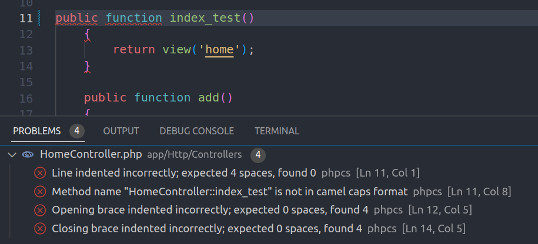
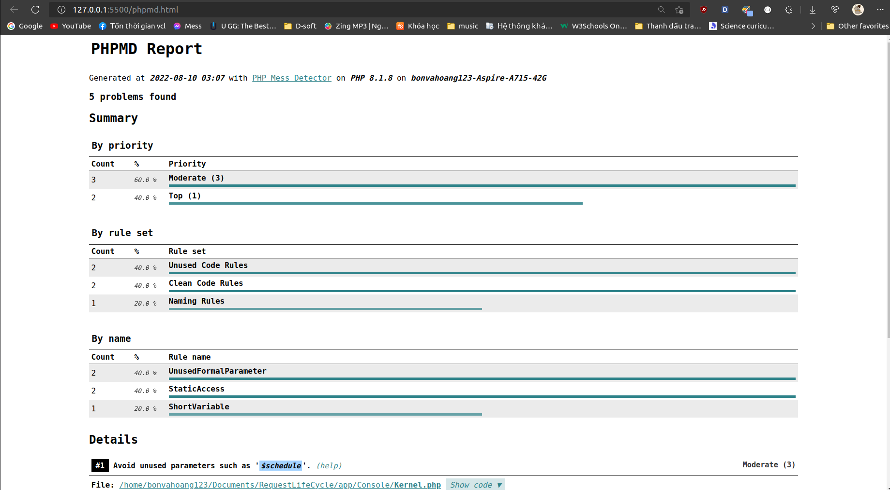

# I. PHP Code Sniffer(phpcs)
- PHPCS là một công cụ giúp kiểm tra các coding convention đối với PHP thì tuân theo chuẩn PSR1 và PSR2.
- PHPCS gồm 2 tập lệnh PHP:
    + Lệnh **phpcs** dùng để mã hóa các tệp PHP, JS, CSS để phát hiện các vi phạm coding convention.
    + Lệnh **phpcbf** dùng để tự động sửa các phần code vi phạm coding convention.
- Đây là một công cụ giúp Project của ta sạch sẽ, tuân thủ các coding convention mà không mất thời gian để tự mình check.
- Cách dùng 
    + Dùng lệnh cmd phpcs để check vi phạm và lệnh phpcbf để tự động sửa các phần vi phạm:
        * phpcs --standard=PSR2 /path/to/code-directory hoặc phpcs --standard=PSR2 /path/to/code.php
        * phpcbf --standard=PSR2 /path/to/code-directory hoặc phpcbf --standard=PSR2 /path/to/code.php
    + Cài extension phpcs trên vscode để hiện ra lỗi trực tiếp
<br>


# II. PHP Mess Detector(phpmd)
- PHPMD là một công cụ phân tích source code, để tìm ra các vấn đề gây ảnh hưởng không tốt cho việc phát triển, bảo trị project sau này
- PHPMD không phải lúc nào cũng có thể giúp bạn tìm ra bugs, mà nó tập trung giúp bạn tìm ra những đoạn code "có mùi" và đưa ra lời khuyên cho bạn về cách sửa chúng, để source code của dự án được "sạch đẹp" hơn. Những vấn đề mà PHPMD có thể giúp bạn:

    + Possible bugs: Một số đoạn có thể có lỗi xảy ra. Do PHPMD chỉ phân tích static code, nó không thể tìm ra lỗi logic trong code được
    + Suboptimal code: Những đoạn code chưa thực sự tối ưu
    + Overcomplicated expressions: Những biểu thức, cách viết quá phức tạp
    + Unused parameters, methods, properties: Những biến, hàm, thuộc tính được define nhưng không được sử dụng

- Cách sử dụng
  + vendor/bin/phpmd <tên_file_hoặc_thư_mục_src> <định_dạng_kết_qủa_trả_về> <ruleset1,ruleset2,...>
  + Ví dụ tạo ra file phpmd.html để check các phân tích code trong thư mục app với các rule:
    ```
    vendor/bin/phpmd app html cleancode,codesize,controversial,design,naming,unusedcode > phpmd.html
    ```
    
  + Định dạng kết quả trả về có thể là xml, text hoặc html
  + Có thể kết hợp nhiều ruleset cùng 1 lúc ngăn cách bởi dấu ,. Các bộ ruleset mặc định gồm: cleancode, codesize, controversial, design, naming, unusedcode.
    * cleancode: Clean Code Rules là tập hợp một số quy tắc liên quan đến việc viết code clean, chủ yếu là dựa trên việc tuân thủ SOLID Principles
    * codesize: Code Size Rules là tập hợp các quy tắc liên quan đến những vấn đề về kích thước, độ phức tạp của hàm, của class ...
    * controversial: Controversial Rules là tập hợp các quy tắc thường gây tranh cãi như cách đặt tên biến global, lớp, hàm, thuộc tính, tham số, biến
    * design: Design Rules là các quy tắc liên quan đến việc thiết kế phần mềm
    * naming: Naming rules là các quy tắc liên quan đến việc đặt tên biến, hàm sao cho hợp lý. Bổ sung cho các quy tắc PSR1 và PSR2 như tên biến, tên hàm quá ngắn, quá dài,...
    * unusedcode: Unused Code Rules là các quy tắc liên quan đến việc tìm ra những đoạn code thừa, không được sử dụng trong project.

# III. Questions
## 1. Tại sao phải tuân thủ các rule coding
   - Tuân thủ chuẩn code giúp cho code của chúng ta được sạch đẹp, dễ đọc và dễ hiểu.
   - Làm cho ta dễ dàng debug, dễ maintain và có thể giúp người khác đọc code của mình hiểu được một cách nhanh chóng.
   - Tạo ra một quy tắc thống nhất giữa mọi người trong cùng 1 project để dễ dàng quản lý.
   - Giúp ta code sao để có thể tái sử dụng code một cách nhanh nhất và ngắn gọn nhất.
   - Chia ra các package để dễ làm việc độc lập với nhau, không bị rối.
## 2. Sau khi sử dụng các tool phpcs và phpmd, bạn rút ra được bài học gì? 
   - Các tool này giúp việc kiểm tra code có vi phạm các quy tắc code và phân tích code để tìm ra các vấn đề tiềm ẩn một cách nhanh chóng, chính xác hơn là chính ta ngồi tự tìm.
   - Hai thứ này giúp ta thống nhất cách code với nhau một cách dễ dàng hơn.
