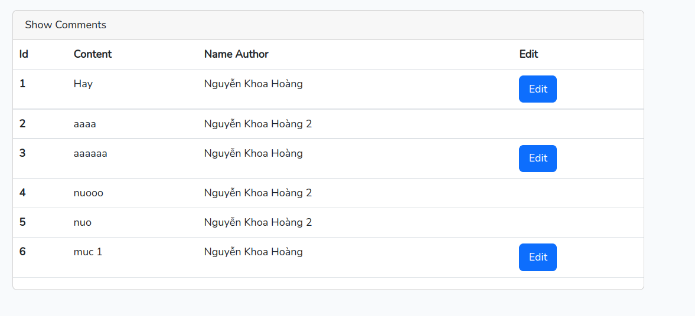

# I. Authentication
- Đây là chức năng đăng nhập, đăng ký 
- Laravel cung cấp sẵn cho chúng ta một db có bảng User, đây là bảng chứa các dữ liệu mà chúng ta thao tác.
## 1. Chức năng đăng nhập
- Để thực hiện đăng nhập thì chúng ta dùng hàm attempt của lớp Auth có sẵn để xác thực thông tin đăng nhập
```
    public function authenticate(Request $request)
    {
        $credentials = $request->validate([
            'email' => ['required', 'email'],
            'password' => ['required'],
        ]);
 
        // Kiểm tra thông tin email và password có đúng với thông tin trong bảng User hay ko
        if (Auth::attempt($credentials)) {
            return redirect()->route('dashboard');
        }
 
        return back()->withErrors([
            'email' => 'The provided credentials do not match our records.',
        ]);
    }
```

- Để kiểm tra xem user đã đăng nhập hay chưa chúng ta dùng hàm check() của lớp auth() hoặc dùng middleware('auth') trong route
```
    public function home()
    {
        // Kiểm tra xem đã đăng nhập hay chưa
        if (auth()->check()) {
            return redirect()->route('home');
        }
        return view('login');
    }
```
hoặc
```
    // Middleware('auth') xác thực xem user đã đăng nhập hay chưa thì mới được truy cập vào đường dẫn
    Route::prefix('/home')->middleware('auth')->group(function () {
        Route::middleware('password.confirm')->get('/', [HomeController::class, 'index'])->name('home');

        Route::get('/show-info', [HomeController::class, 'showInfo'])->name('showInfo');
        Route::put('/update-info', [HomeController::class, 'updateInfo'])->name('updateInfo');
    });
```

- Để đăng nhập thông qua một đối tượng User
```
    Auth::login($user);
```
## 2. Chức năng đăng ký
- Để đăng ký một tài khoản-user mới, chúng ta tạo 1 User vào db như bình thường
```
    public function store(Request $request)
    {
        // Validate các thông tin nhập vào
        $request->validate([
            'name' => ['required', 'string', 'max:255'],
            'email' => ['required', 'string', 'email', 'max:255', 'unique:users'],
            'password' => ['required', 'confirmed', Rules\Password::defaults()],
        ]);

        // Tạo user mới và đăng nhập cho user đó
        $user = User::create([
            'name' => $request->name,
            'email' => $request->email,
            'password' => Hash::make($request->password),
        ]);

        event(new Registered($user));

        Auth::login($user);

        return redirect(RouteServiceProvider::HOME);
    }
```

## 3. Truy xuất thông tin người dùng đã đăng nhập
```
    // Lấy ra người dùng hiện tại
    $user = Auth::user();
    
    // Lấy ra id của người dùng hiện tại
    $id = Auth::id();

    // Lấy ra tên của người dùng hiện tại
    $name = Auth::user()->name;
```

## 4. Đăng xuất
```
    Auth::logout();
```

# II. Authorization
- Phân quyền các user sẽ được định nghĩa thông qua các Gate tại file App\Providers\AuthServiceProvider
```
    // Ở đây kiểm tra xem nếu comment có user_id trùng với id của user đang đăng nhập thì trả về true và ngược lại
    Gate::define('edit-comment', function ($user, $comment) {
        return $user->id == $comment->user_id;
    });
```

- Để sử dụng Gate trong Controller
```
    $comment = Comment::find($comment_id);

    // Dùng allows để xác nhận người dùng này có được edit comment này không
    if (Gate::allows('edit-comment', $comment)) {
        return "Ban co quyen";
    } else {
        return "Ban ko co quyen";

    // Hoặc dùng denies để xem người dùng có bị từ chối edit comment này không
    // if (Gate::denies('edit-comment', $comment)) {
    //     return 'Ban ko co quyen';
    // } else {
    //     return "Ban co quyen";
    // }   
}
```

- Gate::before dùng để kiểm tra trước khi kiểm tra các gate khác, nếu nó trả về là kết qua not null có nghĩa là true or false thì không cần kiểm tra các Gate::define khác nữa, tương tự như before là after nhưng kiểm tra sau
```
Gate::before(function ($user, $ability) {
    if ($user->isAdministrator()) {
        return true;
    }
});

Gate::after(function ($user, $ability, $result, $arguments) {
    if ($user->isAdministrator()) {
        return true;
    }
});
```
- Policy dùng để phân quyền thao tác nhất định với một Model nào đó.
- Tạo ra một Policy của một model Comment
```
php artisan make:policy PostPolicy --model=Post
```

- Sau đó đăng ký Policy tại file AuthServiceProvider
```
protected $policies = [
    Comment::class => CommentPolicy::class
];
```

- Tại file CommentPolicy ta định nghĩa lại hàm update như thế này
```
    public function update(User $user, Comment $comment)
    {
        return $user->id == $comment->user_id;
    }
```

- Sử dụng Policy tại controller
```
    $comment = Comment::find($comment_id);
    // Tìm Lớp Policy nào có phương thức update dùng Model Comment để xác nhận quyền
    if ($request->user()->can('update', $comment)) {
        return "Ban co quyen";
    } else {
        echo "Ban ko co quyen";
    }

    // Hoặc dùng authorize() để trả về trang lỗi mặc định do Laravel cung cấp
    $this->authorize('update', $comment);
```
- Nếu có những phân quyền không cần dùng model thì ta chỉ cần khai báo cái Model chính của nó là được
```
    if ($request->user()->cannot('create', Comment::class)) {
        abort(403);
    }
```

- Dùng policy thông qua route
```
Route::post('/create', function () {
    // The current user may create comment...
})->can('create', Comment::class);
```

- Dùng thông qua blade template
```
    @foreach ($comments as $comment)
        <tr>
            <th scope="row">{{ $comment->id }}</th>
            <td>{{ $comment->content }}</td>
            <td>{{ $comment->user->name }}</td>
            <td>
                // Dùng @can và truyền phương thức + model vào
                @can('update', $comment)
                    <a class="btn btn-primary"
                        href="{{ route('commment.edit', ['comment_id' => $comment->id]) }}">Edit</a>
                @endcan
            </td>
        </tr>
    @endforeach
```
 + Kết quả sẽ như thế này




